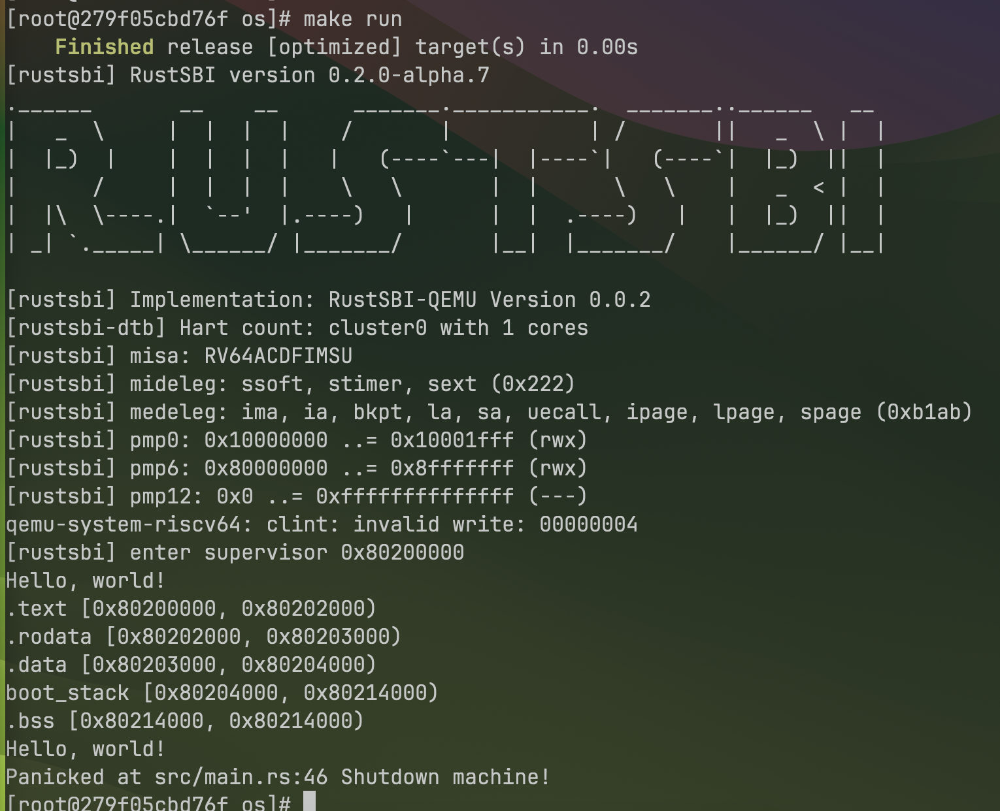

# 实验2 - 裸机环境和最小化内核

> 21301021 肖斌

> 所用设备及系统：Macbook Pro M2 Max, MacOS Sonoma 14.0.0

> GitHub 仓库：https://github.com/AzurIce/OperatingSystem-2023

## 一、实验步骤

### 1. 编译生成内核镜像

编译 `os/` 内的代码：

```shell
cargo build --release
```


然后，再把编译生成的 ELF 执行文件转成 binary 文件：

```shell
rust-objcopy --binary-architecture=riscv64 target/riscv64gc-unknown-none-elf/release/os --strip-all -O binary target/riscv64gc-unknown-none-elf/release/os.bin
```

> 在运行之前，还需要在os目录的同级目录增加bootloader rustsbi.bin。Rustsbi.bin可以通过https://github.com/rustsbi/rustsbi-qemu下载。

> 注意：请使用老师给的rustsbi.bin，因为版本的不同会造成潜在的问题。

接着，加载运行生成的二进制文件：

```shell
qemu-system-riscv64 -machine virt -nographic -bios ../bootloader/rustsbi.bin -device loader,file=target/riscv64gc-unknown-none-elf/release/os.bin,addr=0x80200000
```


这时候运行会进入死循环，原因是操作系统的入口地址不对！

对于 os ELF 执行程序，通过 rust-readobj 分析，看到的入口地址不是约定的 0x80200000。

注意：退出qemu可以通过Docker Desktop里的容器的命令行杀死qemu的进程。

具体分析命令如下：

```shell
rust-readobj -h target/riscv64gc-unknown-none-elf/release/os
```


因此，我们还需要修改 os ELF执行程序的内存布局。

### 2. 指定内存布局

通过链接文件linker.ld可以实现指定可执行文件的内存布局。同时，我们还需要修改Cargo的配置文件来使用我们的链接脚本而不是默认的内存布局。

首先，修改os/.cargo/config，增加如下内容：

```
[target.riscv64gc-unknown-none-elf]
rustflags = [
    "-C", "link-arg=-Tsrc/linker.ld",
]
```

创建链接脚本文件 `os/src/linker.ld`，内容如下：

```
OUTPUT_ARCH(riscv)
ENTRY(_start)
BASE_ADDRESS = 0x80200000;

SECTIONS
{
    . = BASE_ADDRESS;
    skernel = .;

    stext = .;
    .text : {
        *(.text.entry)
        *(.text .text.*)
    }
    
    . = ALIGN(4K);
    etext = .;
    srodata = .;
    .rodata : {
        *(.rodata .rodata.*)
        *(.srodata .srodata.*)
    }
    
    . = ALIGN(4K);
    erodata = .;
    sdata = .;
    .data : {
        *(.data .data.*)
        *(.sdata .sdata.*)
    }
    
    . = ALIGN(4K);
    edata = .;
    .bss : {
        *(.bss.stack)
        sbss = .;
        *(.bss .bss.*)
        *(.sbss .sbss.*)
    }
    
    . = ALIGN(4K);
    ebss = .;
    ekernel = .;
    
    /DISCARD/ : {
        *(.eh_frame)
    }
}
```

### 3. 配置栈空间布局

为了程序能够正确的执行，我们还需要设置正确的栈空间。

栈空间的通过汇编 `entry.asm` 来建立，文件位于 `os/src/entry.asm`。
文件内容具体如下：

```
    .section .text.entry
    .globl _start

_start:
    la sp, boot_stack_top
    call rust_main

    .section .bss.stack
    .globl boot_stack

boot_stack:
    .space 4096 * 16
    .globl boot_stack_top
boot_stack_top:
```

然后，我们还需要在 main.rs 中嵌入这些汇编代码并声明应用入口 rust_main。

```rust
use core::arch::global_asm;

global_asm!(include_str!("entry.asm"));

#[no_mangle]
pub fn rust_main() -> ! {
    loop{};
}
```

### 4. 清空 BSS 段

为了保证内存的正确性，我们还需要撰写代码清空.bss段。在main.rs中增加如下代码：

```rust
fn clear_bss() {
    extern "C" {
        fn sbss();
        fn ebss();
    }
    (sbss as usize..ebss as usize).for_each(|a| unsafe { (a as *mut u8).write_volatile(0) });
}
```

### 5. 实现裸机打印输出信息

为了实现在裸机上能够打印信息，我们需要把之前的系统调用改成sbi调用即可实现。同时，我们还可以调用sbi提供的接口实现关机的功能。

`os/src/sbi.rs` 具体内容如下：

```rust
#![allow(unused)]

use core::arch::asm;

const SBI_SET_TIMER: usize = 0;
const SBI_CONSOLE_PUTCHAR: usize = 1;
const SBI_CONSOLE_GETCHAR: usize = 2;
const SBI_CLEAR_IPI: usize = 3;
const SBI_SEND_IPI: usize = 4;
const SBI_REMOTE_FENCE_I: usize = 5;
const SBI_REMOTE_SFENCE_VMA: usize = 6;
const SBI_REMOTE_SFENCE_VMA_ASID: usize = 7;
const SBI_SHUTDOWN: usize = 8;

#[inline(always)]
fn sbi_call(which: usize, arg0: usize, arg1: usize, arg2: usize) -> usize {
    let mut ret;
    unsafe {
        asm!("ecall",
             in("x10") arg0,
             in("x11") arg1,
             in("x12") arg2,
             in("x17") which,
             lateout("x10") ret
        );
    }
    ret
}

pub fn console_putchar(c: usize) {
    sbi_call(SBI_CONSOLE_PUTCHAR, c, 0, 0);
}

pub fn console_getchar() -> usize {
    sbi_call(SBI_CONSOLE_GETCHAR, 0, 0, 0)
}

pub fn shutdown() -> ! {
    sbi_call(SBI_SHUTDOWN, 0, 0, 0);
    panic!("It should shutdown!");
}
```

在sbi.rs提供接口的基础上，根据前一节print函数的实现，我们实现裸机上的print函数。

具体在os/src/console.rs中，其内容具体如下：

```rust
use crate::sbi::console_putchar;
use core::fmt::{self, Write};
struct Stdout;
impl Write for Stdout {
    fn write_str(&mut self, s: &str) -> fmt::Result {
        for c in s.chars() {
            console_putchar(c as usize);
        }
        Ok(())
    }
}
pub fn print(args: fmt::Arguments) {
    Stdout.write_fmt(args).unwrap();
}
#[macro_export]
macro_rules! print {
    ($fmt: literal $(, $($arg: tt)+)?) => {
        $crate::console::print(format_args!($fmt $(, $($arg)+)?));
    }
}
#[macro_export]
macro_rules! println {
    ($fmt: literal $(, $($arg: tt)+)?) => {
        $crate::console::print(format_args!(concat!($fmt, "\n") $(, $($arg)+)?));
    }
}
```

在 `main.rs` 中添加：

```rust
mod sbi;
mod console;
```

并整理代码，删除上节实验中无关的代码。

### 6. 给异常处理增加输出信息

最后，再给异常处理函数panic增加输出显示，以便我们更好的了解程序的执行情况。
实现os/src/lang_items.rs，其内容如下：


```rust
use crate::sbi::shutdown;
use core::panic::PanicInfo;

#[panic_handler]
fn panic(info: &PanicInfo) -> ! {
    if let Some(location) = info.location() {
        println!(
            "Panicked at {}:{} {}",
            location.file(),
            location.line(),
            info.message().unwrap()
        );
    } else {
        println!("Panicked: {}", info.message().unwrap());
    }
    shutdown()
}
```

注意需要在 main.rs 开头加上 #![feature(panic_info_message)] 才能通过 PanicInfo::message 获取报错信息。


### 7. 修改main.rs输出测试信息

修改main.rs为如下内容：

```rust
#![no_std]
#![no_main]
#![feature(panic_info_message)]
#[macro_use]

mod console;
mod lang_items;
mod sbi;

use core::arch::global_asm;

global_asm!(include_str!("entry.asm"));
fn clear_bss() {
    extern "C" {
        fn sbss();
        fn ebss();
    }
    (sbss as usize..ebss as usize).for_each(|a| unsafe { (a as *mut u8).write_volatile(0) });
}

#[no_mangle]
pub fn rust_main() -> ! {
    extern "C" {
        fn stext();
        fn etext();
        fn srodata();
        fn erodata();
        fn sdata();
        fn edata();
        fn sbss();
        fn ebss();
        fn boot_stack();
        fn boot_stack_top();
    }
    clear_bss();
    println!("Hello, world!");
    println!(".text [{:#x}, {:#x})", stext as usize, etext as usize);
    println!(".rodata [{:#x}, {:#x})", srodata as usize, erodata as usize);
    println!(".data [{:#x}, {:#x})", sdata as usize, edata as usize);
    println!(
        "boot_stack [{:#x}, {:#x})",
        boot_stack as usize, boot_stack_top as usize
    );
    println!(".bss [{:#x}, {:#x})", sbss as usize, ebss as usize);
    println!("Hello, world!");
    panic!("Shutdown machine!");
}
```

### 8. 编译！

编译：

```shell
cargo build --release
```

生成二进制文件：

```shell
rust-objcopy --binary-architecture=riscv64 target/riscv64gc-unknown-none-elf/release/os --strip-all -O binary target/riscv64gc-unknown-none-elf/release/os.bin
```

运行：

```shell
qemu-system-riscv64 -machine virt -nographic -bios ../bootloader/rustsbi.bin -device loader,file=target/riscv64gc-unknown-none-elf/release/os.bin,addr=0x80200000
```

上述编译步骤可以通过下面的 Makefile 文件实现：

```
# Building
TARGET := riscv64gc-unknown-none-elf
MODE := release
KERNEL_ELF := target/$(TARGET)/$(MODE)/os
KERNEL_BIN := $(KERNEL_ELF).bin
DISASM_TMP := target/$(TARGET)/$(MODE)/asm

# BOARD
SBI ?= rustsbi
BOOTLOADER := ../bootloader/$(SBI).bin

# KERNEL ENTRY
KERNEL_ENTRY_PA := 0x80200000

# Binutils
OBJDUMP := rust-objdump --arch-name=riscv64
OBJCOPY := rust-objcopy --binary-architecture=riscv64

# Disassembly
DISASM ?= -x

build: $(KERNEL_BIN)

env:
	(rustup target list | grep "riscv64gc-unknown-none-elf (installed)") || rustup target add $(TARGET)
	cargo install cargo-binutils
	rustup component add rust-src
	rustup component add llvm-tools-preview

$(KERNEL_BIN): kernel
	@$(OBJCOPY) $(KERNEL_ELF) --strip-all -O binary $@

kernel:
	@cargo build --release

clean:
	@cargo clean

disasm: kernel
	@$(OBJDUMP) $(DISASM) $(KERNEL_ELF) | less

disasm-vim: kernel
	@$(OBJDUMP) $(DISASM) $(KERNEL_ELF) > $(DISASM_TMP)
	@vim $(DISASM_TMP)
	@rm $(DISASM_TMP)

run: build
	@qemu-system-riscv64 \
		-machine virt \
		-nographic \
		-bios $(BOOTLOADER) \
		-device loader,file=$(KERNEL_BIN),addr=$(KERNEL_ENTRY_PA)

debug: build
	@tmux new-session -d \
		"qemu-system-riscv64 -machine virt -nographic -bios $(BOOTLOADER) -device loader,file=$(KERNEL_BIN),addr=$(KERNEL_ENTRY_PA) -s -S" && \
		tmux split-window -h "riscv64-unknown-elf-gdb -ex 'file $(KERNEL_ELF)' -ex 'set arch riscv:rv64' -ex 'target remote localhost:1234'" && \
		tmux -2 attach-session -d

.PHONY: build env kernel clean disasm disasm-vim run
```

然后 `make run`：


## 二、思考问题

### 1. 分析linker.ld和entry.asm所完成的功能

linker.ld 规定了整个程序各个数据段的存储布局，本实验中最关键的功能就是以 `BASE_ADDRESS` 即 `0x80200000` 配置入口，使用 `rust-readobj` 分析可以得到：


与先前未使用自定 linker 时相比，入口地址设定为了 `0x80200000`，使得 bootloader 能够在这个内存地址找到我们的程序。

而 entry.asm 实际上也是一个程序，用汇编语言编写，它负责在无操作系统支持的环境（裸机环境）下调用我们用 rust 编写的主函数。

### 2. 分析sbi模块和lang_items模块所完成的功能

sbi 模块封装了读取字符、输出字符、退出（关机）的 sbi 调用，即对应着实验一中所封装的系统调用。

而 lang_items 中定义了一个函数，通过 `#[panic_handler]` 注册为 panic 发生时的 handler，在其中额外打印了panic相关的信息，包含文件、行号。

### 3. 可选：如果将rustsbi.bin换成最新版本的会造成代码无法运行，分析原因并给出解决方法。

#### 最新版 [Prereleased 2023-10-27](https://github.com/rustsbi/rustsbi-qemu/releases/tag/Unreleased)

> 经测试，依然可以运行


#### [0.2.0-alpha.2](https://github.com/rustsbi/rustsbi-qemu/releases/tag/v0.2.0-alpha.2)

> 有问题，运行直接卡住

> 原因未知（），问题应该在于 rustsbi 中，因为 sbi 甚至无输出，只运行 sbi 表现一样。


### [version 0.1.1](https://github.com/rustsbi/rustsbi-qemu/releases/tag/v0.1.1)

> 无问题


### [version 0.1.0](https://github.com/rustsbi/rustsbi-qemu/releases/tag/v0.1.0)

> 无问题


### [version 0.0.2](https://github.com/rustsbi/rustsbi-qemu/releases/tag/v0.0.2)

> 无问题




### [version 0.0.1](https://github.com/rustsbi/rustsbi-qemu/releases/tag/v0.0.1)

> 无问题


## 三、Git 提交截图


## 四、其他说明

