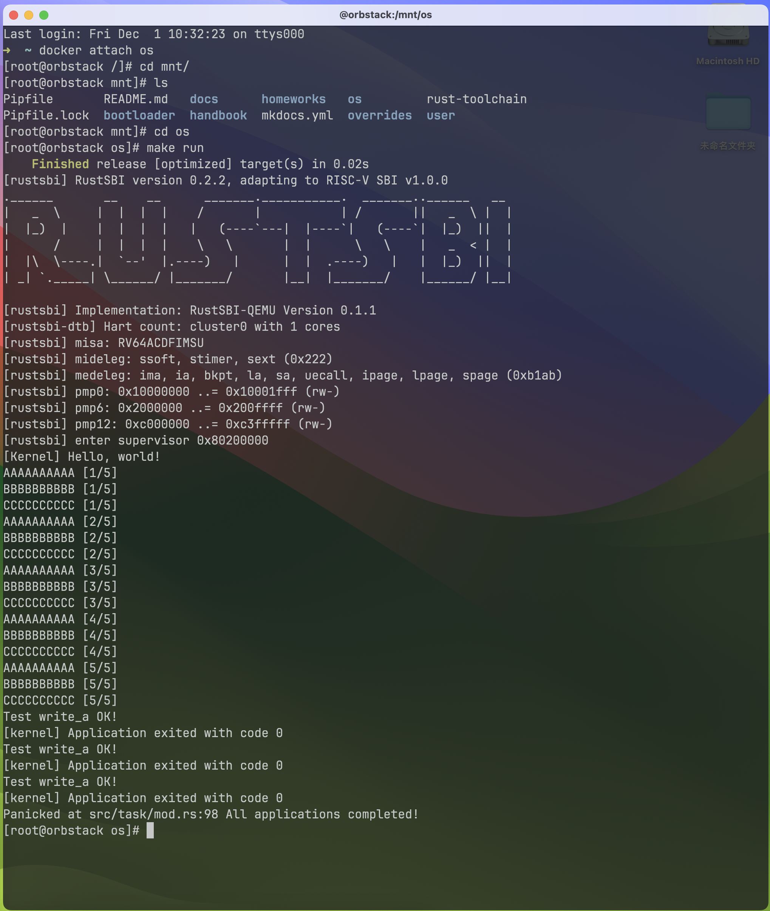
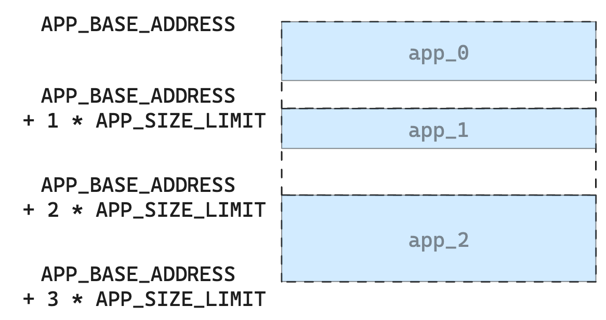
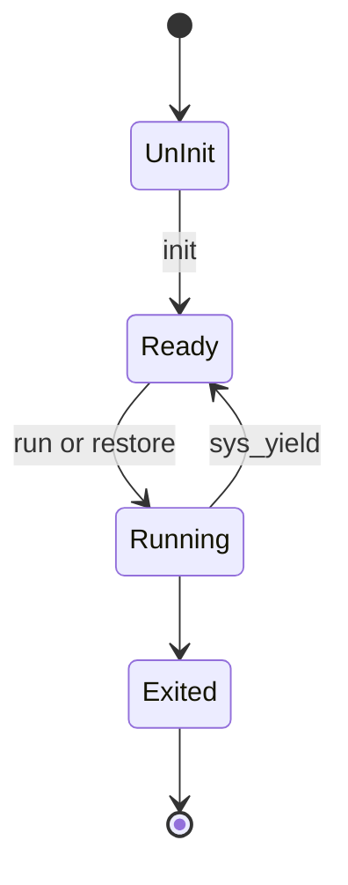

# 实验4 - 多道程序与协作式操作系统

> 21301021 肖斌

> 所用设备及系统：Macbook Pro M2 Max, MacOS Sonoma 14.1.2

> GitHub 仓库：https://github.com/AzurIce/OperatingSystem-2023

本实验的主要目的是实现一个支持多道程序和协作式调度的操作系统。

上一节实验实现的批处理操作系统中，同一时间只会在内存中驻留一个应用。只有当这个程序出错或退出后才会加载加一个程序到相同的内存区域。

「多道程序」（Multiprogramming）是另一种运行方式，唯一的区别就是同一时间在内存中驻留多个应用，依旧在前一个程序出错或退出后再执行另一个程序。这样的运行方式在内存容量在逐渐增大，处理器的速度也在增加的背景下能够提高操作系统的效率。

而「协作式操作系统」指让应用在执行 I/O 操作或空闲时，可以主动释放处理器，让其他应用继续执行。当每个应用都有这种「协作」的意识时，整个系统的效率将得到提升。（然而实际情况下并不能保证程序能够正确地在合适的位置释放处理器，因此诞生了「抢占式操作系统」，然而这就是下一节实验的内容了）。

## 一、实验步骤

### 1. 实现应用程序

多道程序操作系统的应用程序跟批处理操作系统的应用程序实现基本是一致的，主要的区别在于应用程序加载到内存中的位置不同。

同时，在协作式操作系统中，我们的应用程序应该可以主动让出CPU切换到其他应用程序。

#### 1.1 应用程序的加载

在批处理操作系统中，应用程序加载的内存位置是相同的。但是在多道程序操作系统中，每个应用程序加载的位置是不同的。

因此我们需要为每个应用程序定制不同的 `linker.ld` 链接脚本，设置不同的 `BASE_ADDRESS`，这部分我们通过编写一个 `build.py` 脚本来实现：

```python title="user/build.py"
import os

base_address = 0x80400000
step = 0x20000
linker = 'src/linker.ld'

app_id = 0
apps = os.listdir('src/bin')
apps.sort()
for app in apps:
    app = app[:app.find('.')]
    lines = []
    lines_before = []
    with open(linker, 'r') as f:
        for line in f.readlines():
            lines_before.append(line)
            line = line.replace(hex(base_address), hex(base_address+step*app_id))
            lines.append(line)
    with open(linker, 'w+') as f:
        f.writelines(lines)
    os.system('cargo build --bin %s --release' % app)
    print('[build.py] application %s start with address %s' %(app, hex(base_address+step*app_id)))
    with open(linker, 'w+') as f:
        f.writelines(lines_before)
    app_id = app_id + 1
```

同时，还需要修改 `Makefile` 来使用我们的 `build.py`：

```diff title="user/Makefile"
TARGET := riscv64gc-unknown-none-elf
MODE := release
APP_DIR := src/bin
TARGET_DIR := target/$(TARGET)/$(MODE)
APPS := $(wildcard $(APP_DIR)/*.rs)
ELFS := $(patsubst $(APP_DIR)/%.rs, $(TARGET_DIR)/%, $(APPS))
BINS := $(patsubst $(APP_DIR)/%.rs, $(TARGET_DIR)/%.bin, $(APPS))

OBJDUMP := rust-objdump --arch-name=riscv64
OBJCOPY := rust-objcopy --binary-architecture=riscv64

-elf:
-	@cargo build --release
-	@echo $(APPS)
-	@echo $(ELFS)
-	@echo $(BINS)
-
+elf: $(APPS)
+	@python3 build.py
+
binary: elf
	$(foreach elf, $(ELFS), $(OBJCOPY) $(elf) --strip-all -O binary $(patsubst $(TARGET_DIR)/%, $(TARGET_DIR)/%.bin, $(elf));)

build: binary

+clean:
+	@cargo clean
+
+.PHONY: elf binary build clean
```

#### 1.2 增加 yield 系统调用

`yield` 系统调用用于主动让出CPU。

首先修改 `user/src/syscall.rs` 添加 yield 系统调用：

```rust title="user/src/syscall.rs"
const SYSCALL_YIELD: usize = 124;

pub fn sys_yield() -> isize {
    syscall(SYSCALL_YIELD, [0, 0, 0])
}
```

然后修改 `user/src/lib.rs` 添加对 `sys_yield` 的封装：

```rust title="user/src/lib.rs"
pub fn yield_() -> isize { sys_yield() }
```

> 这里加一个下划线是为了与保留关键字区分

目前我们为用户库添加了 `yield` 系统调用，具体的系统调用的实现支持后续还要在操作系统中添加。

#### 1.3 实现测试应用程序

在目录 `user/src/bin` 目录下创建 `00write_a.rs`、`01write_b.rs`、`02write_c.rs` 三个测试应用程序，分别输出字母 `A`、`B`、`C`，其中 `00write_a.rs` 内容如下，其他同理：

```rust title="user/src/bin/00write_a.rs"
#![no_std]
#![no_main]

#[macro_use]
extern crate user_lib;

use user_lib::yield_;

const WIDTH: usize = 10;
const HEIGHT: usize = 5;

#[no_mangle]
fn main() -> i32 {
    for i in 0..HEIGHT {
        for _ in 0..WIDTH { print!("A"); }
        println!(" [{}/{}]", i + 1, HEIGHT);
        yield_();
    }
    println!("Test write_a OK!");
    0
}
```

#### 1.4 构建

在 `user` 目录下执行 `make build`。

### 2. 修改操作系统

首先我们需要移除掉 `os/src/batch.rs`，并注释掉 `os/src/trap/mod.rs` 中的 `run_next_app()` 和 `batch` 模块的 use。

#### 2.1 多道程序的加载

在批处理操作系统中，应用程序的加载和执行都是由 `batch` 子模块还处理的。

而在多道程序操作系统中，应用程序的加载和执行分为两个模块来完成：

- `loader` 子模块负责应用程序的加载
- `task` 子模块负责应用的执行和切换。

另外，不同于批处理操作系统，多道程序操作系统所用的应用程序在内核初始化的时候就一起加载到内存中。

##### 1> 提取常量

为了代码结构清晰，我们编辑 `os/src/main.rs` 添加一个 `config` 模块并创建对应的 `os/src/config.rs`，将一些常量提取到 `os/src/config.rs` 中：

```rust title="os/src/main.rs"
mod config;
```

```rust title="os/src/config.rs"
pub const USER_STACK_SIZE: usize = 4096 * 2;
pub const KERNEL_STACK_SIZE: usize = 4096 * 2;
pub const MAX_APP_NUM: usize = 4;
pub const APP_BASE_ADDRESS: usize = 0x80400000;
pub const APP_SIZE_LIMIT: usize = 0x20000;
```

##### 2> 实现 loader

编辑 `os/src/main.rs` 添加一个 `loader` 模块，并创建对应的 `os/src/loader.rs`：

```rust title="os/src/loader.rs"
use core::arch::asm;

use crate::trap::TrapContext;
use crate::task::TaskContext;
use crate::config::*;

#[repr(align(4096))]
#[derive(Copy, Clone)]
struct KernelStack {
    data: [u8; KERNEL_STACK_SIZE],
}

#[repr(align(4096))]
#[derive(Copy, Clone)]
struct UserStack {
    data: [u8; USER_STACK_SIZE],
}

static KERNEL_STACK: [KernelStack; MAX_APP_NUM] = [
    KernelStack { data: [0; KERNEL_STACK_SIZE], };
    MAX_APP_NUM
];

static USER_STACK: [UserStack; MAX_APP_NUM] = [
    UserStack { data: [0; USER_STACK_SIZE], };
    MAX_APP_NUM
];

impl KernelStack {
    fn get_sp(&self) -> usize {
        self.data.as_ptr() as usize + KERNEL_STACK_SIZE
    }
    pub fn push_context(&self, trap_cx: TrapContext, task_cx: TaskContext) -> &'static mut TaskContext {
        unsafe {
            let trap_cx_ptr = (self.get_sp() - core::mem::size_of::<TrapContext>()) as *mut TrapContext;
            *trap_cx_ptr = trap_cx;
            let task_cx_ptr = (trap_cx_ptr as usize - core::mem::size_of::<TaskContext>()) as *mut TaskContext;
            *task_cx_ptr = task_cx;
            task_cx_ptr.as_mut().unwrap()
        }
    }
}

impl UserStack {
    fn get_sp(&self) -> usize {
        self.data.as_ptr() as usize + USER_STACK_SIZE
    }
}

```

这里和之前的批处理操作系统有几点区别：

- KernelStack 和 UserStack 都实现了 `Copy` 和 `Clone` trait
- 全局的 KERNEL_STACK/USER_STACK 中包含 MAX_APP_NUM 个 KernelStack/UserStack，不再是单个
- KernelStack 的 `push_context` 方法参数中额外添加了 `TaskContext`（这个是任务的上下文信息，会在后续讲到）

此外还有如下部分，这部分代码尤为重要，是加载应用程序的逻辑：

```rust title="os/src/loader.rs" linenums=50
fn get_base_i(app_id: usize) -> usize {
    APP_BASE_ADDRESS + app_id * APP_SIZE_LIMIT
}

pub fn get_num_app() -> usize {
    extern "C" { fn _num_app(); }
    unsafe { (_num_app as usize as *const usize).read_volatile() }
}

pub fn load_apps() {
    extern "C" { fn _num_app(); }
    let num_app_ptr = _num_app as usize as *const usize;
    let num_app = get_num_app();
    let app_start = unsafe {
        core::slice::from_raw_parts(num_app_ptr.add(1), num_app + 1)
    };
    // clear i-cache first
    unsafe { asm!("fence.i"); }
    // load apps
    for i in 0..num_app {
        let base_i = get_base_i(i);
        // clear region
        (base_i..base_i + APP_SIZE_LIMIT).for_each(|addr| unsafe {
            (addr as *mut u8).write_volatile(0)
        });
        // load app from data section to memory
        let src = unsafe {
            core::slice::from_raw_parts(app_start[i] as *const u8, app_start[i + 1] - app_start[i])
        };
        let dst = unsafe {
            core::slice::from_raw_parts_mut(base_i as *mut u8, src.len())
        };
        dst.copy_from_slice(src);
    }
}
```

核心部分就在于 `get_base_i`，用于获取第 `i` 个程序要被加载到的地址。

### 3. 实现「任务」

我们把一个计算执行过程称之为「任务」。一个应用程序的任务切换到另外一个应用程序的任务称为「任务切换」。

任务切换过程中需要保存的恢复任务重新执行所需的寄存器、栈等内容称为任务的上线文。

这部分和批处理操作系统中的 Trap 切换很相似，不过更简单，区别于Trap的切换，任务的切换不涉及到特权级的切换。

##### 1> 任务上下文

编辑 `os/src/main.rs` 添加 `task` 模块：

```rust title="os/src/main.rs"
mod task;
```

对应的创建 `os/src/task/mod.rs`，然后编辑它，添加一个 `context` 子模块，并创建对应的 `os/src/task/context.rs`：

```rust title="os/src/task/mod.rs"
mod context;
```

```rust title="os/src/task/context.rs"
#[repr(C)]
pub struct TaskContext {
    ra: usize,
    s: [usize; 12],
}

impl TaskContext {
    pub fn goto_restore() -> Self {
        extern "C" { fn __restore(); }
        Self {
            ra: __restore as usize,
            s: [0; 12],
        }
    }
}
```

这里 `goto_restore` 通过调用 `__restore` 构造一个第一次进入用户态的 Trap 上下文。

需要注意的是和批处理操作系统不一样的是 `__restore` 不在需要开头的 `mv sp, a0`，因为后续的任务切换能够保证 `sp` 指向正确的地址。

因此我们编辑 `os/src/trap.S`，注释掉 `__restore` 中的 `mv sp, a0`

随后编辑 `os/src/loader.rs` 添加上下文初始化部分逻辑：

```rust title="os/src/loader.rs"
pub fn init_app_cx(app_id: usize) -> &'static TaskContext {
    KERNEL_STACK[app_id].push_context(
        TrapContext::app_init_context(get_base_i(app_id), USER_STACK[app_id].get_sp()),
        TaskContext::goto_restore(),
    )
}
```

此部分代码通过先在 KernelStack 压入一个Trap上下文，然后再压入一个通过 TaskContext::goto_restore() 构造的任务上下文来初始化上下文。

##### 2> 任务的运行状态及任务控制块

编辑 `os/src/task/mod.rs` 添加一个 `task` 子模块，并创建对应的 `os/src/task/task.rs`：

```rust title="os/src/task/mod.rs"
mod task;
```

```rust title="os/src/task/task.rs"
#[derive(Copy, Clone, PartialEq)]
pub enum TaskStatus {
    UnInit,
    Ready,
    Running,
    Exited,
}

#[derive(Copy, Clone)]
pub struct TaskControlBlock {
    pub task_cx_ptr: usize,
    pub task_status: TaskStatus,
}

impl TaskControlBlock {
    pub fn get_task_cx_ptr2(&self) -> *const usize {
        &self.task_cx_ptr as *const usize
    }
}
```

`TaskStatus` 枚举定义了任务的运行状态，而 `TaskControlBlock` 用于保存任务的运行信息：

- `task_cx_ptr` 存储了任务上下文的地址指针
- `task_status` 存储了任务的运行状态。

##### 3> 任务切换

任务切换的过程即保存任务的上下文后更新任务状态为暂停，然后回复另一个任务的上下文。

这部分代码通过汇编来实现，编写 `os/src/task/switch.S`：

```assembly title="os/src/task/switch.S"
.altmacro
.macro SAVE_SN n
    sd s\n, (\n+1)*8(sp)
.endm
.macro LOAD_SN n
    ld s\n, (\n+1)*8(sp)
.endm
    .section .text
    .globl __switch

__switch:
    # __switch(
    #     current_task_cx_ptr2: &*const TaskContext,
    #     next_task_cx_ptr2: &*const TaskContext
    # )
    # push TaskContext to current sp and save its address to where a0 points to
    addi sp, sp, -13*8
    sd sp, 0(a0)
    # fill TaskContext with ra & s0-s11
    sd ra, 0(sp)
    .set n, 0
    .rept 12
        SAVE_SN %n
        .set n, n + 1
    .endr
    # ready for loading TaskContext a1 points to
    ld sp, 0(a1)
    # load registers in the TaskContext
    ld ra, 0(sp)
    .set n, 0
    .rept 12
        LOAD_SN %n
        .set n, n + 1
    .endr
    # pop TaskContext
    addi sp, sp, 13*8
    ret
```

随后我们编辑 `os/src/task/mod.rs` 创建 `switch` 子模块，并创建对应的 `os/src/task/switch.rs` 添加对 `__switch` 的封装：

```rust title="os/src/task/mod.rs"
mod switch;
```

```rust title="os/src/task/switch.rs"
use core::arch::global_asm;

global_asm!(include_str!("switch.S"));

extern "C" {
    pub fn __switch(
        current_task_cx_ptr2: *const usize,
        next_task_cx_ptr2: *const usize
    );
}
```

##### 4> 任务管理器

编辑 `os/src/task/mod.rs` 添加全局任务管理器的实现：

```rust title="os/src/task/mod.rs"
use crate::config::MAX_APP_NUM;
use crate::loader::{get_num_app, init_app_cx};
use core::cell::RefCell;
use lazy_static::*;
use switch::__switch;
use task::{TaskControlBlock, TaskStatus};

pub use context::TaskContext;

pub struct TaskManager {
    num_app: usize,
    inner: RefCell<TaskManagerInner>,
}

struct TaskManagerInner {
    tasks: [TaskControlBlock; MAX_APP_NUM],
    current_task: usize,
}

unsafe impl Sync for TaskManager {}

lazy_static! {
    pub static ref TASK_MANAGER: TaskManager = {
        let num_app = get_num_app();
        let mut tasks = [
            TaskControlBlock { task_cx_ptr: 0, task_status: TaskStatus::UnInit };
            MAX_APP_NUM
        ];
        for i in 0..num_app {
            tasks[i].task_cx_ptr = init_app_cx(i) as * const _ as usize;
            tasks[i].task_status = TaskStatus::Ready;
        }
        TaskManager {
            num_app,
            inner: RefCell::new(TaskManagerInner {
                tasks,
                current_task: 0,
            }),
        }
    };
}

impl TaskManager {
    fn run_first_task(&self) {
        self.inner.borrow_mut().tasks[0].task_status = TaskStatus::Running;
        let next_task_cx_ptr2 = self.inner.borrow().tasks[0].get_task_cx_ptr2();
        let _unused: usize = 0;
        unsafe {
            __switch(
                &_unused as *const _,
                next_task_cx_ptr2,
            );
        }
    }

    fn mark_current_suspended(&self) {
        let mut inner = self.inner.borrow_mut();
        let current = inner.current_task;
        inner.tasks[current].task_status = TaskStatus::Ready;
    }
    
    fn mark_current_exited(&self) {
        let mut inner = self.inner.borrow_mut();
        let current = inner.current_task;
        inner.tasks[current].task_status = TaskStatus::Exited;
    }
    
    fn find_next_task(&self) -> Option<usize> {
        let inner = self.inner.borrow();
        let current = inner.current_task;
        (current + 1..current + self.num_app + 1)
            .map(|id| id % self.num_app)
            .find(|id| {
                inner.tasks[*id].task_status == TaskStatus::Ready
            })
    }
    
    fn run_next_task(&self) {
        if let Some(next) = self.find_next_task() {
            let mut inner = self.inner.borrow_mut();
            let current = inner.current_task;
            inner.tasks[next].task_status = TaskStatus::Running;
            inner.current_task = next;
            let current_task_cx_ptr2 = inner.tasks[current].get_task_cx_ptr2();
            let next_task_cx_ptr2 = inner.tasks[next].get_task_cx_ptr2();
            core::mem::drop(inner);
            unsafe {
                __switch(
                    current_task_cx_ptr2,
                    next_task_cx_ptr2,
                );
            }
        } else {
            panic!("All applications completed!");
        }
    }

}

pub fn run_first_task() {
    TASK_MANAGER.run_first_task();
}

fn run_next_task() {
    TASK_MANAGER.run_next_task();
}

fn mark_current_suspended() {
    TASK_MANAGER.mark_current_suspended();
}

fn mark_current_exited() {
    TASK_MANAGER.mark_current_exited();
}

pub fn suspend_current_and_run_next() {
    mark_current_suspended();
    run_next_task();
}

pub fn exit_current_and_run_next() {
    mark_current_exited();
    run_next_task();
}
```

这里类似于批处理操作系统中的 AppManager

### 4. 实现 `sys_yield` 和 `sys_exit` 的系统调用

修改 `os/src/syscall/process.rs`：

```rust title="os/src/syscall/process.rs"
use crate::task::{
    suspend_current_and_run_next,
    exit_current_and_run_next,
};

pub fn sys_exit(exit_code: i32) -> ! {
    println!("[kernel] Application exited with code {}", exit_code);
    exit_current_and_run_next();
    panic!("Unreachable in sys_exit!");
}

pub fn sys_yield() -> isize {
    suspend_current_and_run_next();
    0
}
```

同时在 `os/src/syscall/mod.rs` 添加对 `sys_yield` 的处理：

```diff title="os/src/syscall/mod.rs"
//os/src/syscall/mod.rs

const SYSCALL_WRITE: usize = 64;
const SYSCALL_EXIT: usize = 93;
+const SYSCALL_YIELD: usize = 124;

mod fs;
mod process;

use fs::*;
use process::*;

pub fn syscall(syscall_id: usize, args: [usize; 3]) -> isize {
    match syscall_id {
        SYSCALL_WRITE => sys_write(args[0], args[1] as *const u8, args[2]),
        SYSCALL_EXIT => sys_exit(args[0] as i32),
+        SYSCALL_YIELD => sys_yield(),
        _ => panic!("Unsupported syscall_id: {}", syscall_id),
    }
}
```

### 5. 修改入口

修改 `os/src/main.rs` 中的 `rust_main`：

```rust title="os/src/main.rs"
#[no_mangle]
pub fn rust_main() -> ! {
    clear_bss();
    println!("[kernel] Hello, world!");
    trap::init();
    loader::load_apps();
    task::run_first_task();
    panic!("Unreachable in rust_main!");
}
```

### 6. 运行效果



## 二、思考问题

### 1. 分析应用程序是如何加载的

与上一个实验的批处理操作系统不同，本次实验实现的协作式操作系统在内核加载时直接将全部应用程序加载到内存中，每个程序加载到的地址由所有应用程序的基地址加上 app_id 乘上 app 最大大小得到，即如图：



### 2. 分析多道程序如何设计和实现的

首先，每一个应用程序都有自己的「内核栈」和「用户栈」。

首先是「任务」的「状态」，可以画为如下的状态图：




初识时任务状态为 `UnInit`，在完成此任务的栈初始化（Trap 上下文和 Task 上下文）后会转变为 `Ready`，

处于 `Ready` 状态的任务可以被执行，执行会使其状态变为 `Running`，执行完毕会使其状态变为 `Exited`，

当一个任务调用 `sys_yield` 时，就会将其状态变为 `Ready`，然后从任务列表中寻找状态为 `Ready` 的下一个任务进行切换并执行。

所有任务状态和对应的 Task 上下文地址都会存储在全局的任务管理器中。


然后，如何「切换任务」：

从任务 A 切换到任务 B 时，首先将当前的 `sp` 以及所有寄存器存储到任务 A 的 TaskContext 中（位于任务 A 的内核栈上），以便后续切换回来，然后令 `sp` 指向任务 B 的 TaskConext 的 `ra`（即恢复到任务 B），并从任务 B 的 TaskContext 中恢复所有寄存器。

以及，如何「找到下一个任务」：

也就是遍历任务管理器找到一个 `Ready` 的任务。

### 3. 分析所实现的多道程序操作系统中的任务是如何实现的，以及它和理论课程里的进程和线程有什么区别和联系

多道程序操作系统中的任务有各自的内核栈和用户栈。

理论课程中的进程与其较为相似，都是“某一个运行的应用程序”，而且都是同一时间有多个存在于内存中，然而它与进程的区别是，进程受操作系统调度、切换、分配资源，而任务主动将 CPU 资源交还给操作系统。

而线程是更微小的执行单元，共享同一个进程的资源，并行执行。而我们的多道程序操作系统并无并行执行，而更多的是一种异步的方式。

看起来运行效果好像是三个程序同时运行，但是实际上是操作系统在任务之间进行来回切换，同一时间依旧还是只有一个任务在运行。

## 三、Git 提交记录


## 参考

https://github.com/jameslzhu/riscv-card/blob/master/riscv-card.pdf

http://riscvbook.com/chinese/RISC-V-Reader-Chinese-v2p1.pdf

https://lgl88911.github.io/2021/02/28/RISC-V%E6%B1%87%E7%BC%96%E5%BF%AB%E9%80%9F%E5%85%A5%E9%97%A8/

https://rcore-os.cn/rCore-Tutorial-Book-v3/chapter3/2task-switching.html
