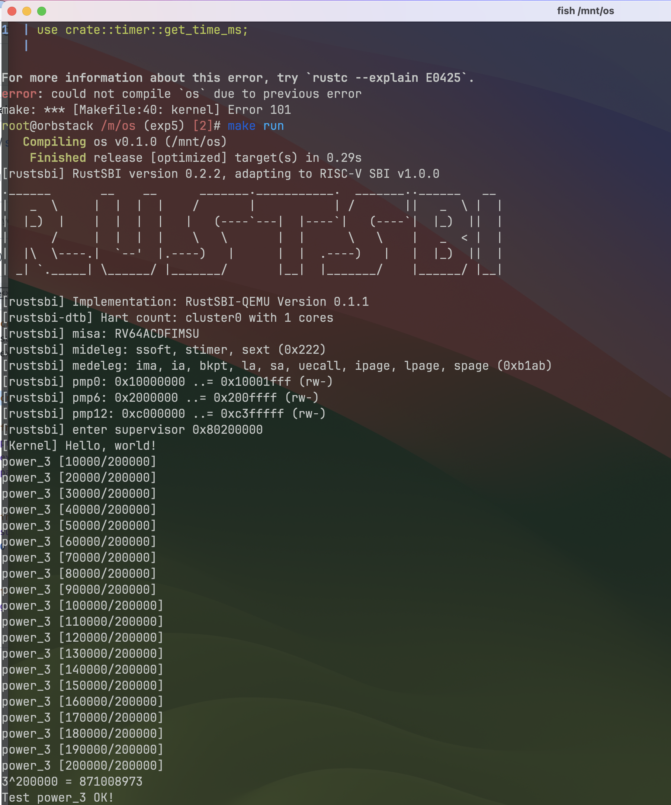
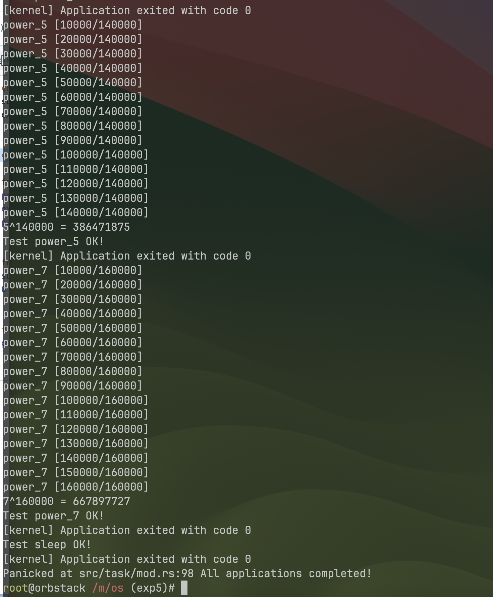
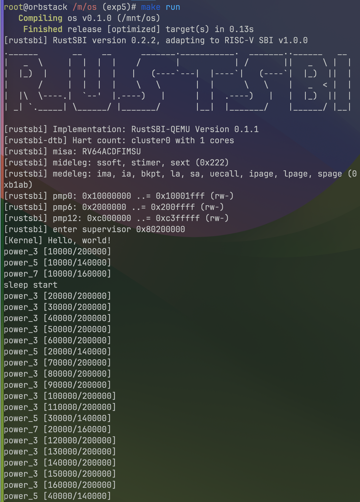
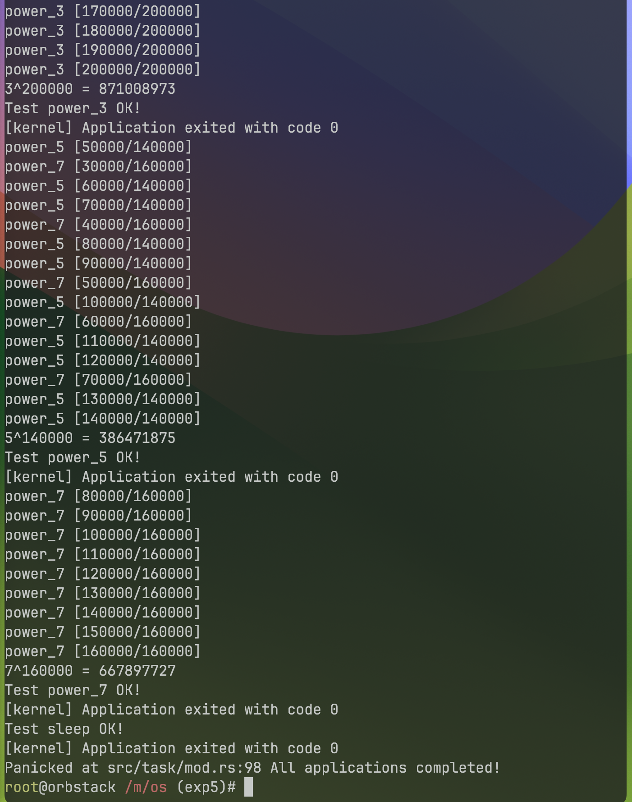
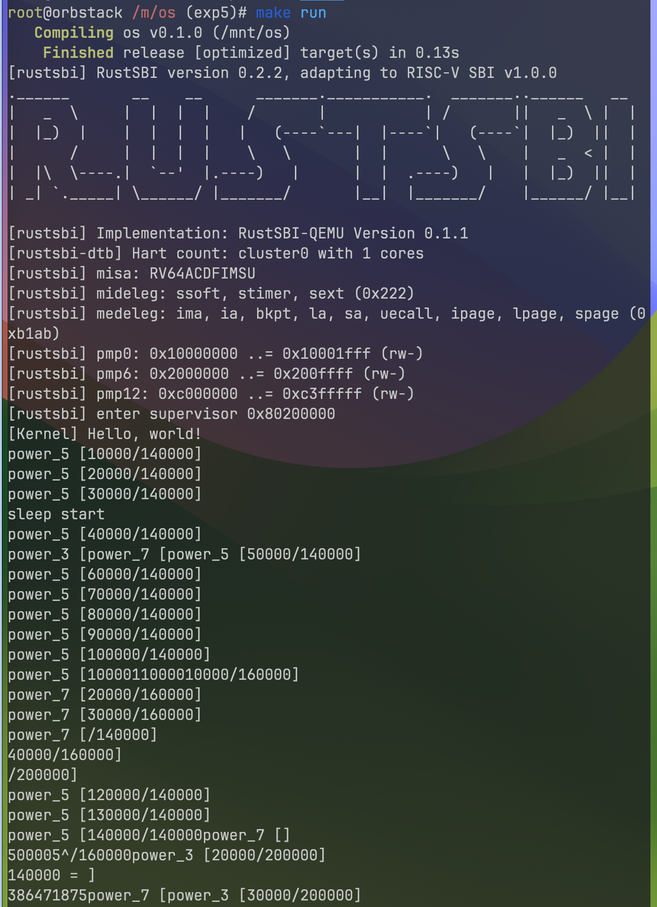
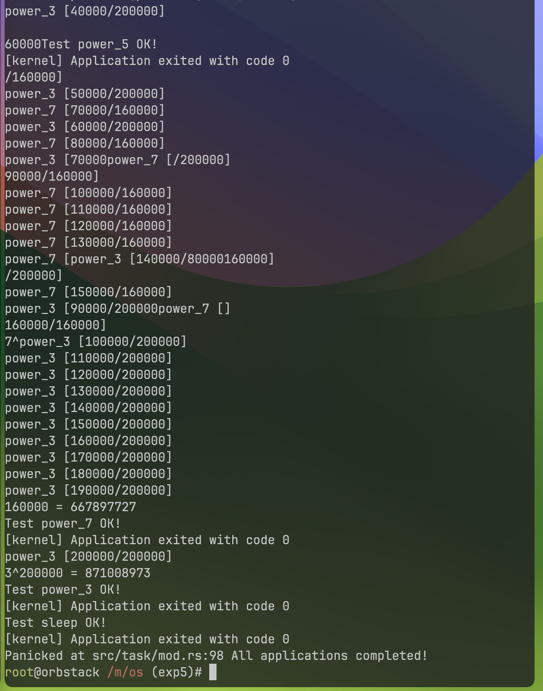

# 实验5 - 分时对任务与抢占式调度

> 21301021 肖斌

> 所用设备及系统：Macbook Pro M2 Max, MacOS Sonoma 14.1.2

> GitHub 仓库：https://github.com/AzurIce/OperatingSystem-2023

## 一、实验步骤

### 1. 时钟中断与计时器

在 RISC-V 64 架构中，有两个状态寄存器 `mtime` 和 `mtimecmp`。其中 `mtime` 统计加电以来内置时钟的时钟周期，`mtimecmp` 用作比较，在 `mtime` 超过 `mtimecmp` 时，触发一次时钟中断。

首先编辑 `os/src/main.rs` 添加 `timer` 模块，并创建对应的 `os/src/timer.rs`：

```rust title="os/src/main.rs"
mod timer;
```

```rust title="os/src/timer.rs"
use riscv::register::time;

pub fn get_time() -> usize {
    time::read()
}
```

然后修改 sbi 模块实现 `mtimecmp` 的设置，并在 timer 模块进行封装：

```rust title="os/src/sbi.rs"
const SBI_SET_TIMER: usize = 0;

pub fn set_timer(timer: usize) {
    sbi_call(SBI_SET_TIMER, timer, 0, 0);
}
```

```rust title="os/src/timer.rs"
use crate::sbi::set_timer;
use crate::config::CLOCK_FREQ;

const TICKS_PER_SEC: usize = 100;

pub fn set_next_trigger() {
    set_timer(get_time() + CLOCK_FREQ / TICKS_PER_SEC);
}
```

为了便于后续的操作，额外在 timer 中封装一个返回当前计数器毫秒值的函数：

```rust title="os/src/timer.rs"
const MSEC_PER_SEC: usize = 1000;

pub fn get_time_ms() -> usize {
    time::read() / (CLOCK_FREQ / MSEC_PER_SEC)
}
```

其中 `CLOCK_FREQ` 是新添加到 `os/src/config.rs` 中的常量：

```rust title="os/src/config.rs"
pub const CLOCK_FREQ: usize = 12500000;
```

然后修改 `os/src/syscall/process.rs` 以及 `os/src/syscall/mod.rs`，添加 get_time 系统调用的实现：

```rust title="os/syscall/process.rs"
use crate::timer::get_time_ms;

pub fn sys_get_time() -> isize {
    get_time_ms() as isize
}
```

```diff title="os/src/syscall/mod.rs"
+const SYSCALL_GET_TIME: usize = 169;

pub fn syscall(syscall_id: usize, args: [usize; 3]) -> isize {
    match syscall_id {
        SYSCALL_WRITE => sys_write(args[0], args[1] as *const u8, args[2]),
        SYSCALL_EXIT => sys_exit(args[0] as i32),
        SYSCALL_YIELD => sys_yield(),
+       SYSCALL_GET_TIME => sys_get_time(),
        _ => panic!("Unsupported syscall_id: {}", syscall_id),
    }
}
```

### 2. 修改应用程序

#### 1> 添加 get_time 系统调用

首先编辑 `user/src/syscall.rs` 添加 `get_time` 系统调用：

```rust title="user/src/syscall.rs"
const SYSCALL_GET_TIME: usize = 169;

pub fn sys_get_time() -> isize {
    syscall(SYSCALL_GET_TIME, [0, 0, 0])
}
```

然后修改 `user/src/lib.rs` 添加 get_time 的封装

```rust title="user/src/lib.rs"
pub fn get_time() -> isize { sys_get_time() }
```

#### 2> 实现新的测试应用：

分别实现 `00power_3.rs`，`01power_5.rs`，`02power_7.rs` 以及 `03sleep.rs` 四个测试应用程序。
其中，`00power_3.rs` 代码如下，三者差别在于 `p` 的值分别为 3, 5, 7，以及输出提示：

```rust title="00power_3.rs"
#![no_std]
#![no_main]

#[macro_use]
extern crate user_lib;

const LEN: usize = 100;

#[no_mangle]
fn main() -> i32 {
    let p = 3u64;
    let m = 998244353u64;
    let iter: usize = 200000;
    let mut s = [0u64; LEN];
    let mut cur = 0usize;
    s[cur] = 1;
    for i in 1..=iter {
        let next = if cur + 1 == LEN { 0 } else { cur + 1 };
        s[next] = s[cur] * p % m;
        cur = next;
        if i % 10000 == 0 {
            println!("power_3 [{}/{}]", i, iter);
        }
    }
    println!("{}^{} = {}", p, iter, s[cur]);
    println!("Test power_3 OK!");
    0
}
```

`03sleep.rs` 代码如下：

```rust title="user/src/bin/03sleep.rs"
#![no_std]
#![no_main]

#[macro_use]
extern crate user_lib;

use user_lib::{get_time, yield_};

#[no_mangle]
fn main() -> i32 {
    let current_timer = get_time();
    let wait_for = current_timer + 3000;
    while get_time() < wait_for {
        yield_();
    }
    println!("Test sleep OK!");
    0
}
```

### 3. 实现抢占式调度

修改 `os/src/trap/mod.rs` 代码，具体如下：

```rust title="os/src/trap/mod.rs"
use riscv::register::{
    mtvec::TrapMode,
    stvec,
    scause::{
        self,
        Trap,
        Exception,
        Interrupt,
    },
    stval,
    sie,
};

use crate::task::{
    exit_current_and_run_next,
    suspend_current_and_run_next,
};

use crate::timer::set_next_trigger;


pub fn enable_timer_interrupt() {
    unsafe { sie::set_stimer(); }
}

#[no_mangle]
pub fn trap_handler(cx: &mut TrapContext) -> &mut TrapContext {
    let scause = scause::read();
    let stval = stval::read();
    match scause.cause() {
        Trap::Exception(Exception::UserEnvCall) => {
            cx.sepc += 4;
            cx.x[10] = syscall(cx.x[17], [cx.x[10], cx.x[11], cx.x[12]]) as usize;
        }
        Trap::Exception(Exception::StoreFault) |
        Trap::Exception(Exception::StorePageFault) => {
            println!("[kernel] PageFault in application, bad addr = {:#x}, bad instruction = {:#x}, core dumped.", stval, cx.sepc);
            exit_current_and_run_next();
        }
        Trap::Exception(Exception::IllegalInstruction) => {
            println!("[kernel] IllegalInstruction in application, core dumped.");
            exit_current_and_run_next();
        }
        Trap::Interrupt(Interrupt::SupervisorTimer) => {
            set_next_trigger();
            suspend_current_and_run_next();
        }
        _ => {
            panic!("Unsupported trap {:?}, stval = {:#x}!", scause.cause(), stval);
        }
    }
    cx
}
```

通过调用 `suspend_current_and_run_next` 实现应用的切换。

然后修改 `os/src/main.rs` 中的入口：

```rust title="os/src/main.rs"
#[no_mangle]
pub fn rust_main() -> ! {
    clear_bss();
    println!("[Kernel] Hello, world!");
    trap::init();
    loader::load_apps();
    trap::enable_timer_interrupt();
    timer::set_next_trigger();
    task::run_first_task();
    panic!("Unreachable in rust_main!");
}
```

至此，支持分时多任务和抢占式调度的操作系统实现完成。

运行效果如下：





这样子还不太能体现得出来调度，我对几个应用程序做了修改：

```rust title="00power3.rs"
#![no_std]
#![no_main]

#[macro_use]
extern crate user_lib;
use user_lib::{get_time, yield_};

const LEN: usize = 100;

#[no_mangle]
fn main() -> i32 {
    let p = 3u64;
    let m = 998244353u64;
    let iter: usize = 200000;
    let mut s = [0u64; LEN];
    let mut cur = 0usize;
    s[cur] = 1;
    for i in 1..=iter {
        let next = if cur + 1 == LEN { 0 } else { cur + 1 };
        s[next] = s[cur] * p % m;
        cur = next;
        if i % 10000 == 0 {
            println!("power_3 [{}/{}]", i, iter);
            let current_timer = get_time();
            let wait_for = current_timer + 10;
            while get_time() < wait_for {
                yield_();
            }
        }
    }
    println!("{}^{} = {}", p, iter, s[cur]);
    println!("Test power_3 OK!");
    0
}
```

```rust title="01power5.rs"
#![no_std]
#![no_main]

#[macro_use]
extern crate user_lib;
use user_lib::{get_time, yield_};

const LEN: usize = 100;

#[no_mangle]
fn main() -> i32 {
    let p = 5u64;
    let m = 998244353u64;
    let iter: usize = 140000;
    let mut s = [0u64; LEN];
    let mut cur = 0usize;
    s[cur] = 1;
    for i in 1..=iter {
        let next = if cur + 1 == LEN { 0 } else { cur + 1 };
        s[next] = s[cur] * p % m;
        cur = next;
        if i % 10000 == 0 {
            println!("power_5 [{}/{}]", i, iter);
            let current_timer = get_time();
            let wait_for = current_timer + 50;
            while get_time() < wait_for {
                yield_();
            }
        }
    }
    println!("{}^{} = {}", p, iter, s[cur]);
    println!("Test power_5 OK!");
    0
}
```

```rust title="02power7.rs"
#![no_std]
#![no_main]

#[macro_use]
extern crate user_lib;
use user_lib::{get_time, yield_};

const LEN: usize = 100;

#[no_mangle]
fn main() -> i32 {
    let p = 7u64;
    let m = 998244353u64;
    let iter: usize = 160000;
    let mut s = [0u64; LEN];
    let mut cur = 0usize;
    s[cur] = 1;
    for i in 1..=iter {
        let next = if cur + 1 == LEN { 0 } else { cur + 1 };
        s[next] = s[cur] * p % m;
        cur = next;
        if i % 10000 == 0 {
            println!("power_7 [{}/{}]", i, iter);
            let current_timer = get_time();
            let wait_for = current_timer + 100;
            while get_time() < wait_for {
                yield_();
            }
        }
    }
    println!("{}^{} = {}", p, iter, s[cur]);
    println!("Test power_7 OK!");
    0
}
```

```rust title="03sleep.rs"
#![no_std]
#![no_main]

#[macro_use]
extern crate user_lib;

use user_lib::{get_time, yield_};

#[no_mangle]
fn main() -> i32 {
    println!("sleep start");
    let current_timer = get_time();
    let wait_for = current_timer + 3000;
    while get_time() < wait_for {
        yield_();
    }
    println!("Test sleep OK!");
    0
}
```

运行效果如下：





可以看到任务之间交替运行了。

**但是！**

这本质上其实类似于协作式调度，因为是通过 `yield` 系统调用让出的 CPU。

于是我又调整了 timer 中的 `TICKS_PER_SEC`，由 `100` 修改为了 `100000`，并且注释了 app 中所有的 `yield` 调用，这时运行效果如下：





这时确确实实是分时调度，或者说，计时器引发的中断在起作用。

而且可以看到，不同任务之间调度时输出会发生混乱，这是因为 CPU 切换到了另一个任务，但前一个任务的输出还没有完成。

## 二、思考问题

### 1. 分析分时多任务是如何实现的

### 2. 分析抢占式调度是如何设计和实现的

我认为上面两个问题其实是一起的。

分时多任务即以「时间片」为单位，让每个任务轮流占有 CPU 执行一段时间。

而抢占式操作系统，与协作式操作系统不同的是并不需要应用程序自己通过 yield 交出 CPU，而可以通过操作系统自身发起中断来切换到另一个任务。

二者的实现如下：

分时多任务只需实现「时间片」，并保证各个任务轮流执行一段时间，在本实验中通过抢占式调度来实现。

具体实现方式时在操作系统初始化时设置第一个中断的触发器（在未来的某个时间触发中断），并且在中断处理中设置新的中断触发器，挂起当前任务，执行下一个任务。以此，实现了一个 Round-Robin 调度算法。

### 3. 对比上个实验实现的协作式调度与本实验实现的抢占式调度

前一个实验中的协作式调度与本实验中的抢占式调度的关键区别就是，协作式调度依赖于应用程序“自觉”让出 CPU 所有权，而抢占式调度中操作系统能够强制性地收回 CPU 的使用权并交给其他的任务。

## 三、Git 提交记录


