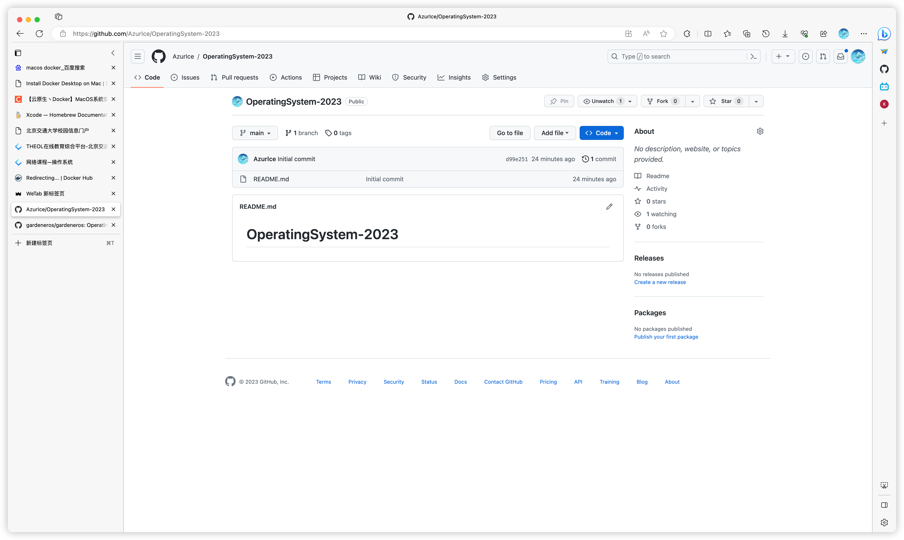
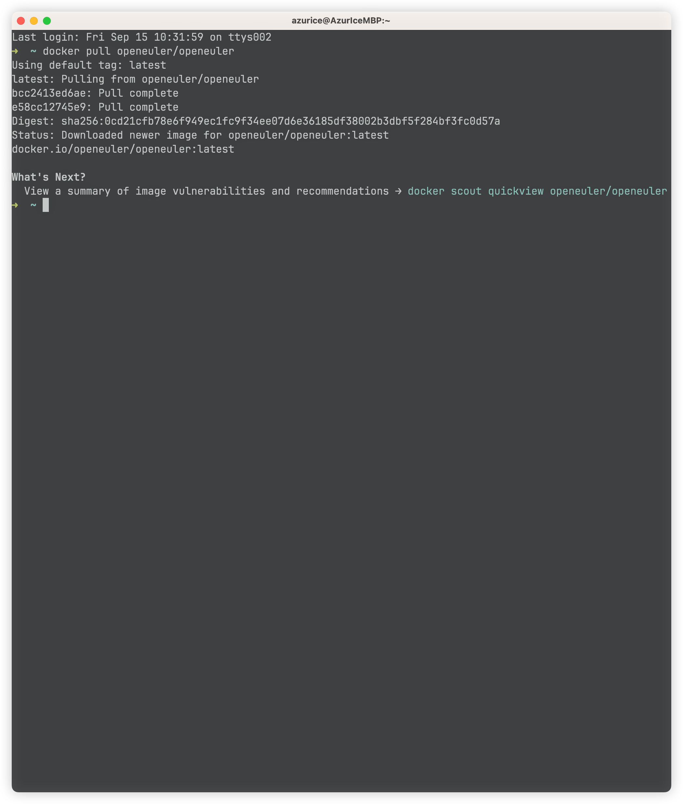
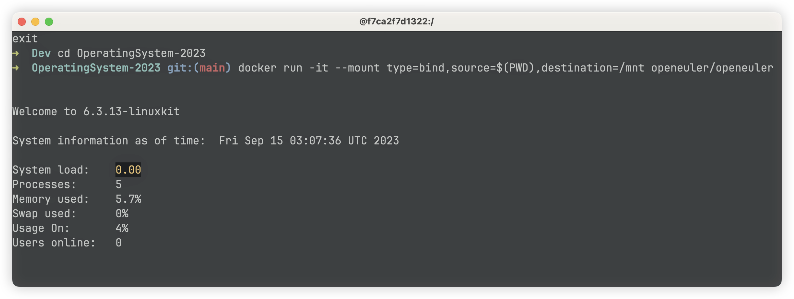
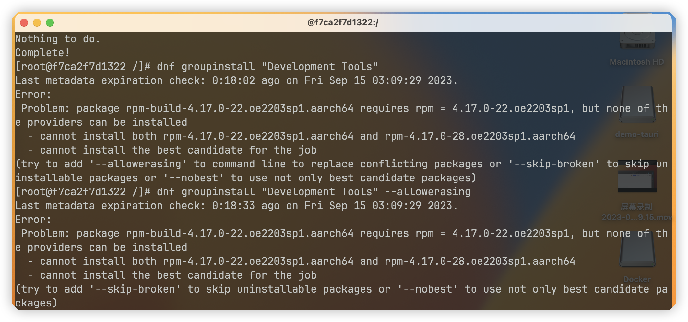
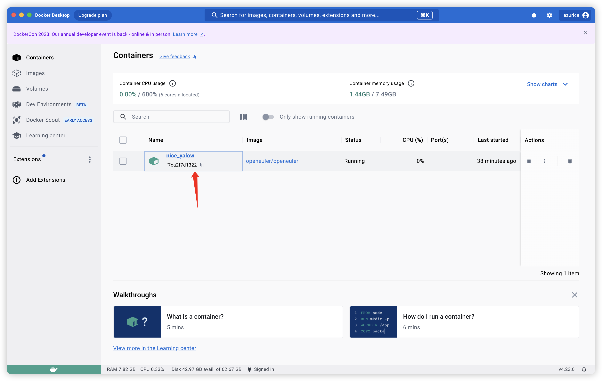
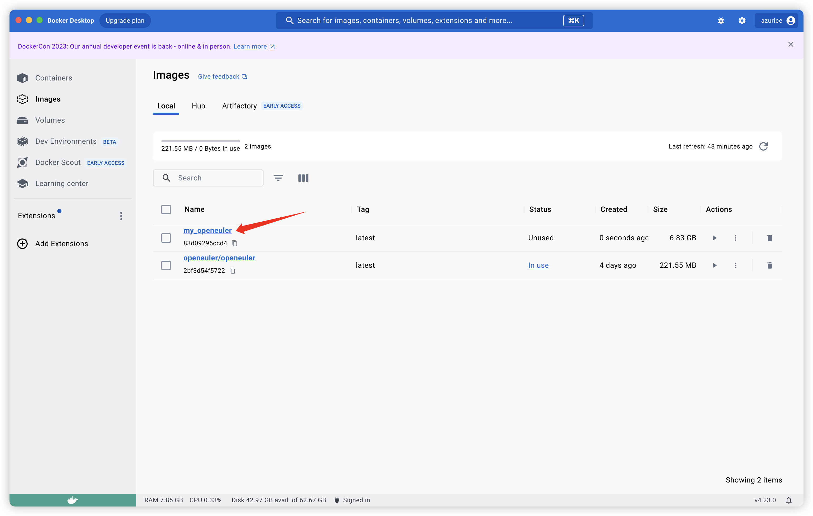
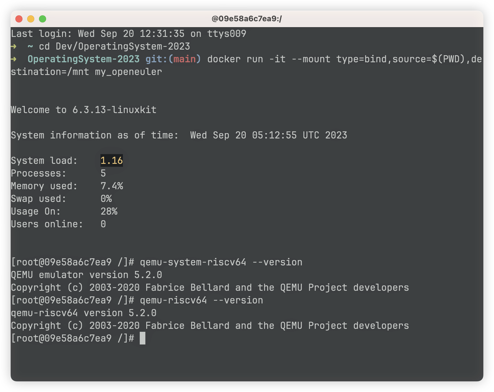

# 实验0 - 配置环境

> 所用设备及系统：Macbook Pro M2 Max, MacOS Ventura 13.5.2

> 因为我有魔法，所以省略了各种镜像源配置相关步骤🥳

## 一、安装 docker

https://www.docker.com/

## 二、创建容器及项目

https://github.com/AzurIce/OperatingSystem-2023

首先创建一个项目：



获取 openeuler 的 docker 镜像：

```bash
docker pull openeuler/openeuler
```



进入到项目目录，创建容器并启动：

```bash
git clone git@github.com:AzurIce/OperatingSystem-2023.git
cd OperatingSystem-2023
docker run -it --mount type=bind,source=$(PWD),destination=/mnt openeuler/openeuler
```



然后便进入了 openeuler 环境，并可以通过 `/mnt` 目录访问到项目文件夹。

## 三、开发环境配置

### 1. 必要软件

```bash
dnf install curl vim gcc git
```

### 2. Rust 开发环境

```bash
curl https://sh.rustup.rs -sSf | sh
source
```

> 可以直接在这一步选择 nightly 版本，或之后再通过下面命令设置：
>
> ```bash
> rustup install nightly
> rustup default nightly
> ```

```bash
rustup target add riscv64gc-unknown-none-elf
cargo install cargo-binutils
rustup component add llvm-tools-preview
rustup component add rust-src
```

然后在 项目目录下心间 `rust-toolchain` 文件，写入 `nightly-2022-10-19` 来固定我们到时候将要使用的 rust 版本

### 3. 安装一些基本的软件包

```bash
dnf groupinstall "Development Tools"
dnf install autoconf automake gcc gcc-c++ kernel-devel curl libmpc-devel mpfr-devel gmp-devel \
              glib2 glib2-devel make cmake gawk bison flex texinfo gperf libtool patchutils bc \
              python3 ninja-build wget xz
```

> 坑1:
>
> 
>
> 先执行一次 `dnf distro-sync` 即可

### 4. 从源码安装 qemu

```bash
wget https://download.qemu.org/qemu-5.2.0.tar.xz
tar xvJf qemu-5.2.0.tar.xz
```

```bash
cd qemu-5.2.0
./configure --target-list=riscv64-softmmu,riscv64-linux-user
make -j$(nproc) install
```

> 安装完成后可以通过如下命令验证qemu是否安装成功。
>
> ```bash
> qemu-system-riscv64 --version
> qemu-riscv64 --version
> ```
>

## 四、保存配置到 docker 镜像中

在docker外（自己的操作系统中）的终端内运行：

```bash
docker commit -m "Configured environment" -a "AzurIce" f7ca2f7d1322077670897839a7a68e5954d5530338117fac026abc6395003405 my_openeuler
```

那一大长串hash字符串来源于这里：



然后可以在 Images 中看到我们刚刚创建的镜像：



可以使用

```
docker run -it --mount type=bind,source=$(PWD),destination=/mnt my_openeuler

```

来用刚才的镜像创建一个容器并运行，其环境正是刚才保存时的环境：


