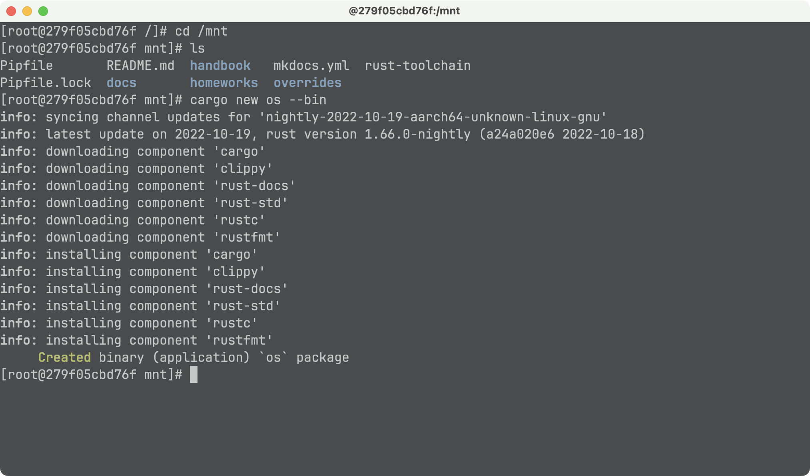
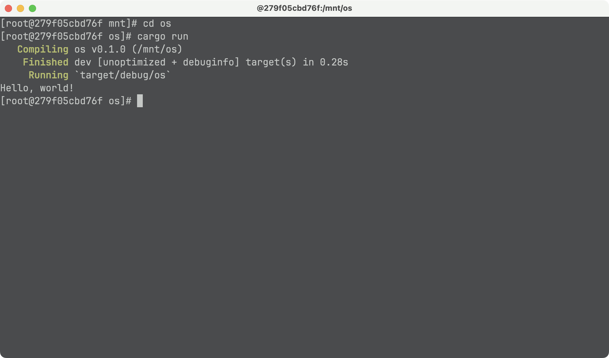
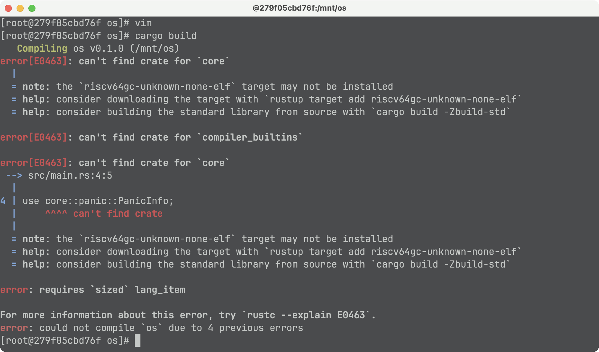
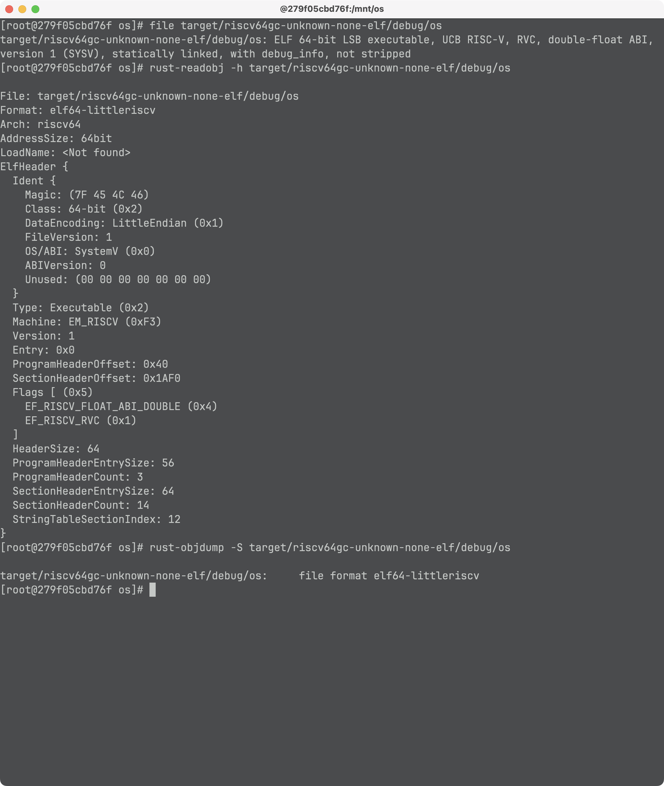
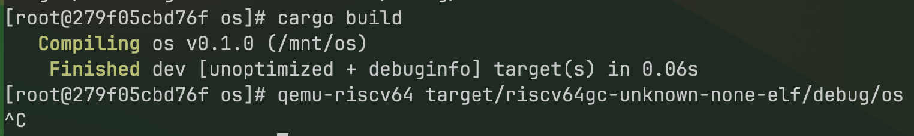
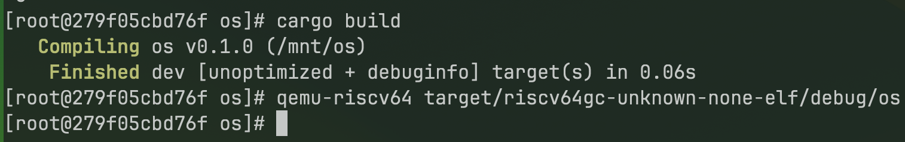
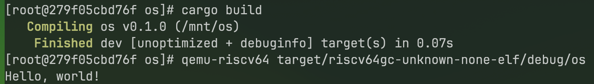

# 实验1 - 独立的可执行程序

> 所用设备及系统：Macbook Pro M2 Max, MacOS Ventura 13.5.2

## 一、实验步骤

### 1. 创建 Rust 项目

本实验的主要目的是构建一个独立的不依赖于 Rust 标准库的可执行程序。

首先进入到项目目录，然后启动包含上一节配置好的环境的容器并进入 `/mnt` 目录：

```
docker run -it --mount type=bind,source=$(PWD),destination=/mnt my_openeuler
cd /mnt
```

创建 Rust 项目：

```bash
cargo new os --bin
```

> 

运行查看结果：

```bash
cd os
cargo run
```

> 

### 2. 移除标准库依赖

首先，修改 target 为 riscv64，在 `os/.cargo/` 目录下创建 `config` 文件，并添加如下内容：

```
# os/.cargo/config
[build]
target = "riscv64gc-unknown-none-elf"
```

然后修改 `main.rs`，在开头加入如下内容，并删除 `main` 函数：

```rust
#![no_std]
#![no_main]
```

同时，因为标准库中提供了 panic 的处理函数 `#[panic_handler]` 所以我们还需要实现 panic handler，添加如下内容：

```rust
use core::panic::PanicInfo;

#[panic_handler]
fn panic(_info: &PanicInfo) -> ! {
    loop {}
}
```

现在如果直接使用 `cargo build` 可能会出现编译错误：



需要执行如下命令添加相关软件包：

```bash
rustup target add riscv64gc-unknown-none-elf
cargo install cargo-binutils
rustup component add llvm-tools-preview
rustup component add rust-src
```

再进行构建：


然后可以对独立的可执行程序进行分析：

```bash
file target/riscv64gc-unknown-none-elf/debug/os
rust-readobj -h target/riscv64gc-unknown-none-elf/debug/os
rust-objdump -S target/riscv64gc-unknown-none-elf/debug/os
```



分析可以发现编译生成的二进制程序是一个空程序，这是因为编译器找不到入口函数，所以没有生成后续的代码。

### 3. 用户态可执行的环境

#### 1> 实现入口函数

首先增加入口函数：

```rust
#[no_mangle]
extern "C" fn _start() {
    loop{};
}
```

Rust 编译器要找的入口函数为 `_start()`。

然后重新编译。

通过如下命令可以执行编译生成的程序：

```bash
qemu-riscv64 target/riscv64gc-unknown-none-elf/debug/os
```

可以发现似乎是在执行一个死循环，即程序无输出，也不结束：



#### 2> 实现退出机制

添加如下代码：

```diff
#![no_std]
#![no_main]

use core::panic::PanicInfo;
+use core::arch::asm;
+
+const SYSCALL_EXIT: usize = 93;
+
+fn syscall(id: usize, args: [usize; 3]) -> isize {
+    let mut ret: isize;
+    unsafe {
+        asm!("ecall",
+             in("x10") args[0],
+             in("x11") args[1],
+             in("x12") args[2],
+             in("x17") id,
+             lateout("x10") ret
+        );
+    }
+    ret
+}
+
+pub fn sys_exit(xstate: i32) -> isize {
+   syscall(SYSCALL_EXIT, [xstate as usize, 0, 0])
+}

#[panic_handler]
fn panic(_info: &PanicInfo) -> ! {
    loop {}
}

#[no_mangle]
extern "C" fn _start() {
-    loop{};
+    sys_exit(9);
}
```

再编译运行，发现程序可以直接正常退出：



#### 3> 实现输出支持

首先封装一下对 Linux 操作系统内核提供的系统调用 `SYSCALL_WRITE`：

```rust
const SYSCALL_WRITE: usize = 64;

pub fn sys_write(fd: usize, buffer: &[u8]) -> isize {
  syscall(SYSCALL_WRITE, [fd, buffer.as_ptr() as usize, buffer.len()])
}
```

然后声明一个 Stdout 结构体并为其实现 Write Trait：

```rust
struct Stdout;

impl Write for Stdout {
    fn write_str(&mut self, s: &str) -> fmt::Result {
        sys_write(1, s.as_bytes());
        Ok(())
    }
}

pub fn print(args: fmt::Arguments) {
    Stdout.write_fmt(args).unwrap();
}
```

然后给予 `print` 函数，实现本存在于 Rust 语言标准库中的的输出宏 `print!` 和 `println!`：

```rust
use core::fmt::{self, Write};

#[macro_export]
macro_rules! print {
    ($fmt: literal $(, $($arg: tt)+)?) => {
        $crate::console::print(format_args!($fmt $(, $($arg)+)?));
    }
}

#[macro_export]
macro_rules! println {
    ($fmt: literal $(, $($arg: tt)+)?) => {
        print(format_args!(concat!($fmt, "\n") $(, $($arg)+)?));
    }
}
```

然后我们可以在入口函数 `_start` 中使用我们实现的 `println!` 宏打印 `Hello, world!`。

完整 diff 如下：

```diff
-- a/os/src/main.rs
+++ b/os/src/main.rs
@@ -4,6 +4,46 @@
 use core::panic::PanicInfo;
 use core::arch::asm;

+// Wrap of SYSCALL_WRITE
+const SYSCALL_WRITE: usize = 64;
+
+pub fn sys_write(fd: usize, buffer: &[u8]) -> isize {
+  syscall(SYSCALL_WRITE, [fd, buffer.as_ptr() as usize, buffer.len()])
+}
+
+// Implement Write trait for Stdout
+struct Stdout;
+
+impl Write for Stdout {
+    fn write_str(&mut self, s: &str) -> fmt::Result {
+        sys_write(1, s.as_bytes());
+        Ok(())
+    }
+}
+
+pub fn print(args: fmt::Arguments) {
+    Stdout.write_fmt(args).unwrap();
+}
+
+// Implement print macro
+use core::fmt::{self, Write};
+
+#[macro_export]
+macro_rules! print {
+    ($fmt: literal $(, $($arg: tt)+)?) => {
+        $crate::console::print(format_args!($fmt $(, $($arg)+)?));
+    }
+}
+
+#[macro_export]
+macro_rules! println {
+    ($fmt: literal $(, $($arg: tt)+)?) => {
+        print(format_args!(concat!($fmt, "\n") $(, $($arg)+)?));
+    }
+}
+
+
+// Wrap of SYSCALL_EXIT
 const SYSCALL_EXIT: usize = 93;

 fn syscall(id: usize, args: [usize; 3]) -> isize {
@@ -31,5 +71,6 @@ fn panic(_info: &PanicInfo) -> ! {

 #[no_mangle]
 extern "C" fn _start() {
+    println!("Hello, world!");
     sys_exit(9);
 }
```

编译运行：



## 二、思考问题

### 1. 为什么称最后实现的程序为独立的可执行程序，它和标准的程序有什么区别？

标准的程序中包含了标准库中实现的一系列内容，可以理解为最终的可执行文件中还包含标准库中的代码。

之所以称最后实现的程序为 *独立的可执行程序*，就是因为它并不依赖于标准库，而是完全通过操作系统内核提供的系统调用来实现一系列功能。

比如 *退出程序* 和 *输出宏*。

`print!` 和 `println!` 在标准库中是有实现的，其实在标准库中的底层部分也是通过 *系统调用* 来实现的，只不过可能有针对各种不同平台的详细代码，比如在 Linux 下通过 Linux 的系统调用实现，在 Windows 下通过 Windows 的 API 实现，等等。

### 2. 实现和编译独立可执行程序的目的是什么？

其实这一次实验相当于从底层，从最基本的积木「系统调用」来与系统交互，搭出了「标准库」的冰山一角。

后面的实验可能会要我们手动去实现一个操作系统，而编程语言的标准库中是不包含对我们自己实现的操作系统的具体实现的，所以我们不可能依赖标准库来写我们的代码，只能同样用最基本的积木来与我们自己的操作系统进行交互。

## 三、Git 提交截图

