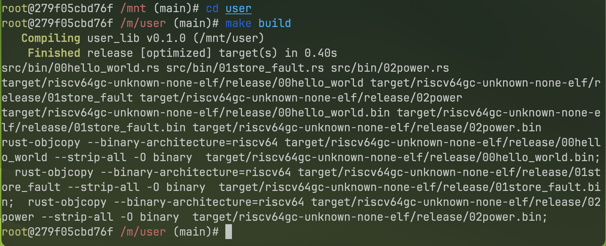
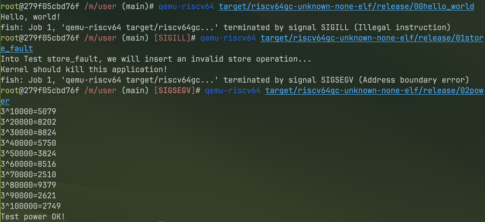
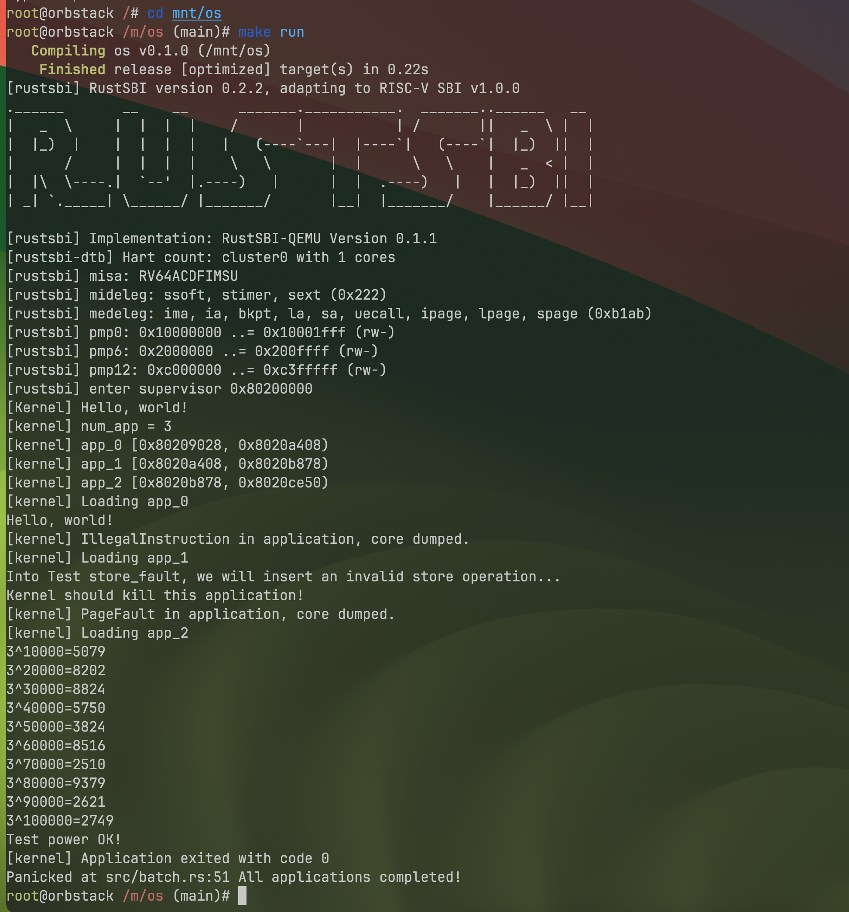

# 实验3 - 批处理与特权级

> 21301021 肖斌

> 所用设备及系统：Macbook Pro M2 Max, MacOS Sonoma 14.0.0

> GitHub 仓库：https://github.com/AzurIce/OperatingSystem-2023

本实验的主要目的是实现一个简单的批处理操作系统并理解特权级的概念。

## 一、设计和实现应用程序

实现一个简单的批处理操作系统，需要先实现应用程序，要求应用程序在用户态下运行。

应用程序及其对应的库文件放置在工作目录下的 `user` 目录下。

这部分的实现与上一节裸机环境和最小化内核部分有很多相同的实现。

### 1. 实现 user_lib 库

#### 1.1 创建项目

首先，创建 `user_lib` 项目

```shell
cargo new user --name user_lib --lib
```

#### 1.2. 实现系统调用

编辑 `user/src/lib.rs` 并创建 `user/src/syscall.rs` 添加 `syscall` 模块：

```rust title="user/src/lib.rs"
#[!no_std]

mod syscall;
```

```rust title="user/src/syscall.rs"
use core::arch::asm;

const SYSCALL_WRITE: usize = 64;
const SYSCALL_EXIT: usize = 93;

fn syscall(id: usize, args: [usize; 3]) -> isize {
    let mut ret: isize;
    unsafe {
        asm!("ecall",
             in("x10") args[0],
             in("x11") args[1],
             in("x12") args[2],
             in("x17") id,
             lateout("x10") ret
        );
    }
    ret
}

pub fn sys_write(fd: usize, buffer: &[u8]) -> isize {
    syscall(SYSCALL_WRITE, [fd, buffer.as_ptr() as usize, buffer.len()])
}

pub fn sys_exit(exit_code: i32) -> isize {
    syscall(SYSCALL_EXIT, [exit_code as usize, 0, 0])
}
```

然后在 `lib.rs` 中进一步封装：

```diff title="user/src/lib.rs"
#![no_std]

mod syscall;

use syscall::*;

+pub fn write(fd: usize, buf: &[u8]) -> isize { sys_write(fd, buf) }
+pub fn exit(exit_code: i32) -> isize { sys_exit(exit_code) }
```

#### 1.3. 实现格式化输出

为了实现格式化输出，我们还需要把 `Stdout::write_str` 改成基于 `write` 的实现，且传入的 `fd` 参数设置为 `1`，代表标准输出（即输出到屏幕）。

创建 `console` 模块：

```diff title="user/src/lib.rs"
#![no_std]

+pub mod console;
mod syscall;

use syscall::*;

pub fn write(fd: usize, buf: &[u8]) -> isize { sys_write(fd, buf) }
pub fn exit(exit_code: i32) -> isize { sys_exit(exit_code) }
```

```rust title="user/src/console.rs"
use core::fmt::{self, Write};
use super::write;

const STDOUT: usize = 1;

struct Stdout;

impl Write for Stdout {
    fn write_str(&mut self, s: &str) -> fmt::Result {
        write(STDOUT, s.as_bytes());
        Ok(())
    }
}

pub fn print(args: fmt::Arguments) {
    Stdout.write_fmt(args).unwrap();
}
```

然后实现 `print` 和 `println` 宏：

```diff title="user/src/console.rs"
use core::fmt::{self, Write};
use super::write;

const STDOUT: usize = 1;

struct Stdout;

impl Write for Stdout {
    fn write_str(&mut self, s: &str) -> fmt::Result {
        write(STDOUT, s.as_bytes());
        Ok(())
    }
}

pub fn print(args: fmt::Arguments) {
    Stdout.write_fmt(args).unwrap();
}

+#[macro_export]
+macro_rules! print {
+    ($fmt: literal $(, $($arg: tt)+)?) => {
+        $crate::console::print(format_args!($fmt $(, $($arg)+)?));
+    }
+}
+
+#[macro_export]
+macro_rules! println {
+    ($fmt: literal $(, $($arg: tt)+)?) => {
+        $crate::console::print(format_args!(concat!($fmt, "\n") $(, $($arg)+)?));
+    }
+}
```

```diff title="src/user/lib.rs"
#![no_std]

+#[macro_use]
pub mod console;
mod syscall;

use syscall::*;

pub fn write(fd: usize, buf: &[u8]) -> isize { sys_write(fd, buf) }
pub fn exit(exit_code: i32) -> isize { sys_exit(exit_code) }
```

#### 1.4. 实现语义支持，添加 panic 处理函数

此外，还需要实现对panic的处理。

创建 `lang_items` 模块：

```diff title="user/src/lib.rs"
#![no_std]

#[macro_use]
pub mod console;
mod syscall;
+mod lang_items;

use syscall::*;

pub fn write(fd: usize, buf: &[u8]) -> isize { sys_write(fd, buf) }
pub fn exit(exit_code: i32) -> isize { sys_exit(exit_code) }
```

```rust title="user/src/lang_items.rs"
use core::panic::PanicInfo;

#[panic_handler]
fn panic_handler(panic_info: &PanicInfo) -> ! {
    if let Some(location) = panic_info.location() {
        println!(
            "Panicked at {}:{}, {}", 
            location.file(), 
            location.line(), 
            panic_info.message().unwrap());
    } else {
        println!("Panicked: {}", panic_info.message().unwrap());
    }
    loop {}
}
```

#### 1.5. 调整应用程序内存布局

我们还需要将应用程序的起始物理地址调整为 `0x80400000`，这样应用程序都会被加载到这个物理地址上运行，从而进入用户库的入口点，并会在初始化之后跳转到应用程序主逻辑。实现方式类似前一节的 `linker.ld`。

具体代码在 `user/src/linker.ld`，具体内容如下：

```title="user/src/linker.ld"
OUTPUT_ARCH(riscv)
ENTRY(_start)

BASE_ADDRESS = 0x80400000;

SECTIONS
{
    . = BASE_ADDRESS;
    .text : {
        *(.text.entry)
        *(.text .text.*)
    }
    .rodata : {
        *(.rodata .rodata.*)
        *(.srodata .srodata.*)
    }
    .data : {
        *(.data .data.*)
        *(.sdata .sdata.*)
    }
    .bss : {
        start_bss = .;
        *(.bss .bss.*)
        *(.sbss .sbss.*)
        end_bss = .;
    }
    /DISCARD/ : {
        *(.eh_frame)
        *(.debug*)
    }
}
```

同时，注意增加配置文件使用 `linker.ld` 文件，`user/.cargo/config`配置文件的内容如下：
```toml title="user/.cargo/config"
[build]
target = "riscv64gc-unknown-none-elf"

[target.riscv64gc-unknown-none-elf]
rustflags = [
    "-Clink-args=-Tsrc/linker.ld",
]
```

#### 1.6. 最终形成运行时库 lib.rs

定义用户库的入口点 `_start`，`_start` 这段代码编译后会存放在 `.text.entry` 代码段中，这在前面内存布局中已经定义了。此外，通过 `#[linkage = "weak"]` 确保 `lib.rs` 和 `bin` 下同时存在 `main` 的编译能够通过。在 `lib.rs` 增加的代码如下：

```diff title="user/src/lib.rs""
#![no_std]
+#![feature(linkage)]
+#![feature(panic_info_message)]

#[macro_use]
pub mod console;
mod syscall;
mod lang_items;

use syscall::*;

pub fn write(fd: usize, buf: &[u8]) -> isize { sys_write(fd, buf) }
pub fn exit(exit_code: i32) -> isize { sys_exit(exit_code) }

+fn clear_bss() {
+    extern "C" {
+        fn start_bss();
+        fn end_bss();
+    }
+    (start_bss as usize..end_bss as usize).for_each(|addr| {
+        unsafe { (addr as *mut u8).write_volatile(0); }
+    });
+}
+
+#[no_mangle]
+#[link_section = ".text.entry"]
+pub extern "C" fn _start() -> ! {
+    clear_bss();
+    exit(main());
+    panic!("unreachable after sys_exit!");
+}
+
+#[linkage = "weak"]
+#[no_mangle]
+fn main() -> i32 {
+    panic!("Cannot find main!");
+}
```

### 2. 实现应用程序

我们已经实现了实现用用程序所需的库 `user_lib`，接下来我们将使用我们的库实现几个不同的应用程序。

应用程序都存放在 `user/src/bin` 下，每个应用程序的大致结构（模板）如下：

```rust title="user/src/bin/*.rs"
#![no_std]
#![no_main]

#[macro_use]
extern crate user_lib;

#[no_mangle]
fn main() -> i32 {
    0
}
```

这段模板代码通过 `extern crate` 引入了 我们的 `user_lib`，并使用 `#[macro_use]` 引入了其中导出的宏。

#### 2.1 实现 `00hello_world.rs`

```rust title="user/src/bin/00hello_world.rs"
#![no_std]
#![no_main]

use core::arch::asm;

#[macro_use]
extern crate user_lib;

#[no_mangle]
fn main() -> i32 {
    println!("Hello, world!");
    unsafe {
        asm!("sret");
    }
    0
}
```

#### 2.2 实现 `01store_fault.rs`

```rust title="user/src/bin/01store_fault.rs"
#![no_std]
#![no_main]
#[macro_use]
extern crate user_lib;
#[no_mangle]
fn main() -> i32 {
    println!("Into Test store_fault, we will insert an invalid store operation...");
    println!("Kernel should kill this application!");
    unsafe { (0x0 as *mut u8).write_volatile(0); }
    0
}
```

#### 2.3 实现 `02power.rs`

```rust title="user/src/bin/02power.rs"
#![no_std]
#![no_main]
#[macro_use]
extern crate user_lib;
const SIZE: usize = 10;
const P: u32 = 3;
const STEP: usize = 100000;
const MOD: u32 = 10007;
#[no_mangle]
fn main() -> i32 {
    let mut pow = [0u32; SIZE];
    let mut index: usize = 0;
    pow[index] = 1;
    for i in 1..=STEP {
        let last = pow[index];
        index = (index + 1) % SIZE;
        pow[index] = last * P % MOD;
        if i % 10000 == 0 {
            println!("{}^{}={}", P, i, pow[index]);
        }
    }
    println!("Test power OK!");
    0
}
```

### 3. 编译生成应用程序二进制码

编写 `Makefile` 文件，`user/Makefile` 内容如下：

```makefile title="user/Makefile"
TARGET := riscv64gc-unknown-none-elf
MODE := release
APP_DIR := src/bin
TARGET_DIR := target/$(TARGET)/$(MODE)
APPS := $(wildcard $(APP_DIR)/*.rs)
ELFS := $(patsubst $(APP_DIR)/%.rs, $(TARGET_DIR)/%, $(APPS))
BINS := $(patsubst $(APP_DIR)/%.rs, $(TARGET_DIR)/%.bin, $(APPS))

OBJDUMP := rust-objdump --arch-name=riscv64
OBJCOPY := rust-objcopy --binary-architecture=riscv64

elf:
	@cargo build --release
	@echo $(APPS)
	@echo $(ELFS)
	@echo $(BINS)

binary: elf
	$(foreach elf, $(ELFS), $(OBJCOPY) $(elf) --strip-all -O binary $(patsubst $(TARGET_DIR)/%, $(TARGET_DIR)/%.bin, $(elf));)

build: binary
```

执行 `make build` 进行编译：



编译完成后，我们可以利用 `qemu-riscv64` 模拟器执行编译生成的程序：



需要注意的是，特权指令在这里是无法直接执行的。至此，应用程序设计实现完成。

## 二、链接应用程序到内核

我们需要将应用程序的二进制码链接到我们的操作系统中，这样我们才能够在操作系统中加载对应的内存来执行对应的程序。

一种实现方式就是在编译 `os` 时根据 `user/src/bin` 下的文件列表生成一个 `link_app.S`，在其中通过 `.inc_bin` 来将二进制码嵌入，然后在我们 `os` 中通过加载 `link_app.S` 来实现链接。

编写 `os/build.rs` 来增加额外的编译逻辑用以生成用于链接的脚本文件 `link_app.S`。

> `build.rs` 中的内容会在 `cargo build` 时执行

`os/build.rs` 文件的内容具体如下：

```rust title="os/build.rs"
use std::io::{Result, Write};
use std::fs::{File, read_dir};

fn main() {
    println!("cargo:rerun-if-changed=../user/src/");
    println!("cargo:rerun-if-changed={}", TARGET_PATH);
    insert_app_data().unwrap();
}

static TARGET_PATH: &str = "../user/target/riscv64gc-unknown-none-elf/release/";

fn insert_app_data() -> Result<()> {
    let mut f = File::create("src/link_app.S").unwrap();
    let mut apps: Vec<_> = read_dir("../user/src/bin")
        .unwrap()
        .into_iter()
        .map(|dir_entry| {
            let mut name_with_ext = dir_entry.unwrap().file_name().into_string().unwrap();
            name_with_ext.drain(name_with_ext.find('.').unwrap()..name_with_ext.len());
            name_with_ext
        })
        .collect();
    apps.sort();

    writeln!(f, r#"
    .align 3
    .section .data
    .global _num_app

_num_app:
    .quad {}"#, apps.len())?;

    for i in 0..apps.len() {
        writeln!(f, r#"    .quad app_{}_start"#, i)?;
    }
    writeln!(f, r#"    .quad app_{}_end"#, apps.len() - 1)?;
    
    for (idx, app) in apps.iter().enumerate() {
        println!("app_{}: {}", idx, app);
        writeln!(f, r#"
    .section .data
    .global app_{0}_start
    .global app_{0}_end

app_{0}_start:
    .incbin "{2}{1}.bin"
app_{0}_end:"#, idx, app, TARGET_PATH)?;
    }
    Ok(())
}
```

它生成的汇编代码大概长这样：

```assembly title="os/src/link_app.S"

    .align 3
    .section .data
    .global _num_app

_num_app:
    .quad 3
    .quad app_0_start
    .quad app_1_start
    .quad app_2_start
    .quad app_2_end

    .section .data
    .global app_0_start
    .global app_0_end

app_0_start:
    .incbin "../user/target/riscv64gc-unknown-none-elf/release/00hello_world.bin"
app_0_end:

    .section .data
    .global app_1_start
    .global app_1_end

app_1_start:
    .incbin "../user/target/riscv64gc-unknown-none-elf/release/01store_fault.bin"
app_1_end:

    .section .data
    .global app_2_start
    .global app_2_end

app_2_start:
    .incbin "../user/target/riscv64gc-unknown-none-elf/release/02power.bin"
app_2_end:

```

第 13 行开始的三个数据段中分别插入了三个应用程序的二进制镜像，并且注册了一对全局符号 `app_*_start` 和 `app_*_end` 来指示他们的开始和结束位置。

第 3 行开始的数据段使用 `.quad`（用于定义 64-bits 整数）定义了一个 64-bits 整数数组，其中第一个值为应用程序的数量，后面每个值为应用程序的起始地址，最后加上最后一个应用程序的结束地址。同时也使用了一个全局符号 `_num_app` 来指示了这段数组的起始位置。

编辑 `os/src/main.rs` 来使用 `global_asm` 宏来嵌入这段汇编：

```diff title="os/src/main.rs"
// ...

use core::arch::global_asm;

global_asm!(include_str!("entry.asm"));
+global_asm!(include_str!("link_app.S"));

// ...
```

## 三、找到并加载应用程序二进制码

找到并加载应用程序的二进制码的核心组件是一个 `AppManager`，我们修改 `os/src/main.rs`，创建 `os/src/batch.rs` 创建一个 `batch` 模块：

```diff title="main.rs"
#![no_std]
#![no_main]
#![feature(panic_info_message)]
#[macro_use]

mod console;
mod lang_items;
mod sbi;
+mod batch;

// ....
```

```rust title="os/src/batch.rs"
const MAX_APP_NUM: usize = 16;
const APP_BASE_ADDRESS: usize = 0x80400000;
const APP_SIZE_LIMIT: usize = 0x20000;

struct AppManager {
    num_app: usize,
    current_app: usize,
    app_start: [usize; MAX_APP_NUM + 1],
}
```

其中：

- `num_app` 表示应用程序的数量
- `current_app` 表示当前引用程序的下标，
- `app_start` 保存了所有应用程序的起始地址

我们希望将其实例化为一个全局变量，然后由于 Rust 语言的所有权特性，导致我们不能像其他语言那样简单的实现全局可变变量。

所以这里我们借助一个第三方库 `lazy_static`，修改 `os/Cargo.toml` 配置文件，在 `[dependencies]` 下增加如下内容：

```toml
lazy_static = { version = "1.4.0", features = ["spin_no_std"] }
```

然后修改 `batch.rs` 实现全局变量：

```rust title="os/src/batch.rs"
use core::arch::asm;
use core::cell::RefCell;
use lazy_static::*;

const MAX_APP_NUM: usize = 16;
const APP_BASE_ADDRESS: usize = 0x80400000;
const APP_SIZE_LIMIT: usize = 0x20000;

struct AppManager {
    inner: RefCell<AppManagerInner>,
}

struct AppManagerInner {
    num_app: usize,
    current_app: usize,
    app_start: [usize; MAX_APP_NUM + 1],
}

unsafe impl Sync for AppManager {}

lazy_static! {
    static ref APP_MANAGER: AppManager = AppManager {
        inner: RefCell::new({
            extern "C" { fn _num_app(); }
            let num_app_ptr = _num_app as usize as *const usize;
            let num_app = unsafe { num_app_ptr.read_volatile() };
            let mut app_start: [usize; MAX_APP_NUM + 1] = [0; MAX_APP_NUM + 1];
            let app_start_raw: &[usize] = unsafe {
                core::slice::from_raw_parts(num_app_ptr.add(1), num_app + 1)
            };
            app_start[..=num_app].copy_from_slice(app_start_raw);
            AppManagerInner {
                num_app,
                current_app: 0,
                app_start,
            }
        }),
    };
}
```

我们需要为 AppManagerInner 实现几个方法：

- `pub fn print_app_info(&self)`：打印 app 信息，我们会在执行批处理前通过这个方法打印 app 信息。
- `unsafe fn load_app(&self, app_id: usize)`：将对应 app 的二进制码加载到 APP_BASE_ADDRESS 处。
- `pub fn get_current_app(&self) -> usize`：返回当前 app 下标 `self.current_app`
- `pub fn move_to_next_app(&mut self)`：使 `self.current_app` 自增 1 

代码如下：

```rust title="os/src/batch.rs" linenums="39"
// ...

impl AppManagerInner {
    pub fn print_app_info(&self) {
        println!("[kernel] num_app = {}", self.num_app);
        for i in 0..self.num_app {
            println!("[kernel] app_{} [{:#x}, {:#x})", i, self.app_start[i], self.app_start[i + 1]);
        }
    }

    unsafe fn load_app(&self, app_id: usize) {
        if app_id >= self.num_app {
            panic!("All applications completed!");
        }
    
        println!("[kernel] Loading app_{}", app_id);
        // clear icache
        asm!("fence.i");
        // clear app area
        (APP_BASE_ADDRESS..APP_BASE_ADDRESS + APP_SIZE_LIMIT).for_each(|addr| {
            (addr as *mut u8).write_volatile(0);
        });
        let app_src = core::slice::from_raw_parts(
            self.app_start[app_id] as *const u8,
            self.app_start[app_id + 1] - self.app_start[app_id]
        );
        let app_dst = core::slice::from_raw_parts_mut(
            APP_BASE_ADDRESS as *mut u8,
            app_src.len()
        );
        app_dst.copy_from_slice(app_src);
    }
    
    pub fn get_current_app(&self) -> usize { self.current_app }
    
    pub fn move_to_next_app(&mut self) {
        self.current_app += 1;
    }
}
```

## 四、实现特权级切换、用户栈和内核栈

S 和 U 是 RISC-V 的两种特权级，操作系统内核运行在 S 模式下，而用户的应用程序运行在 U 模式下。

我们的批处理操作系统在执行应用前，需要通过一些初始化工作来建立好应用程序的执行环境，进而监控应用程序的执行：

- 当应用程序启动时，初始化应用程序的用户态上下文，切换到用户态，执行应用程序；
- 当应用程序发起系统调用（即发出 Trap）之后，需要到批处理操作系统中进行处理；
- 当应用程序执行出错时，需要到批处理操作系统中杀死该应用并加载运行下一个应用；
- 当应用程序执行结束时，需要到批处理操作系统中加载运行下一个应用（实际上也是通过系统调用 `sys_exit` 来实现的）。

其核心就是触发 Trap 时的根据该 Trap 切换特权级，并在处理完成后返回原特权级。

对于我们的批处理操作系统来说就是：

- 当 CPU 在用户态特权级运行应用程序，触发 Trap 时，切换到内核态特权级。
- 批处理操作系统内核的对应代码响应 Trap，并执行系统调用服务，处理完毕后，再返回用户态特权级继续运行应用程序

也就是如图的过程：


### 1. Trap 上下文

首先编辑 `os/src/main.rs` 创建 `os/src/trap/mod.rs` ，创建 trap 模块，并在其中创建 `context` 子模块声明 `TrapContext` 结构：

```diff title="os/src/trap/mod.rs"
#![no_std]
#![no_main]
#![feature(panic_info_message)]
#[macro_use]

mod console;
mod lang_items;
mod sbi;
mod batch;
+mod trap;

// ....
```

```rust title="os/src/trap/context.rs"
#[repr(C)]
pub struct TrapContext {
    pub x: [usize; 32],
    pub sstatus: Sstatus,
    pub sepc: usize,
}
```

其中：

- `x` 存储了 RISC-V 的所有通用寄存器 `x0~x31` 的状态
- `sstatus` 存储了 Trap 发生前 CPU 所处的特权级信息
- `sepc` 存储了 Trap 发生前执行的最后一条指令地址

### 2. 用户栈和内核栈

编辑 `os/src/batch.rs` 添加用户栈和内核栈的定义：

```rust title="os/src/batch.rs" linenums="77"
// ...
use crate::trap::TrapContext;

const USER_STACK_SIZE: usize = 4096 * 2;
const KERNEL_STACK_SIZE: usize = 4096 * 2;

#[repr(align(4096))]
struct KernelStack {
    data: [u8; KERNEL_STACK_SIZE],
}

#[repr(align(4096))]
struct UserStack {
    data: [u8; USER_STACK_SIZE],
}

static KERNEL_STACK: KernelStack = KernelStack { data: [0; KERNEL_STACK_SIZE] };
static USER_STACK: UserStack = UserStack { data: [0; USER_STACK_SIZE] };
```

为两个类型实现 `get_sp` 方法来获取栈顶地址，同时实现修改内核栈栈顶元素的 `push_context`：

> 在 RISC-V 中栈是向下增长的，栈顶地址即数组的结尾地址，修改栈顶元素即修改数组最后一个元素

```rust title="os/src/batch.rs" linenums="95" 
// ...

impl UserStack {
    fn get_sp(&self) -> usize {
        self.data.as_ptr() as usize + USER_STACK_SIZE
    }
}

impl KernelStack {
    fn get_sp(&self) -> usize {
        self.data.as_ptr() as usize + KERNEL_STACK_SIZE
    }
    pub fn push_context(&self, cx: TrapContext) -> &'static mut TrapContext {
        let cx_ptr = (self.get_sp() - core::mem::size_of::<TrapContext>()) as *mut TrapContext;
        unsafe { *cx_ptr = cx; }
        unsafe { cx_ptr.as_mut().unwrap() }
    }
}
```

### 3. Trap 管理

特权级切换的主要内容就是实现对 trap 的管理：

- 应用程序通过 `ecall` 进入到内核状态时，操作系统保存被打断的应用程序的 Trap 上下文到内核栈上；
- 操作系统根据 Trap 相关的 CSR 寄存器内容，完成系统调用服务的分发与处理；
- 处理完成后，从内核栈上的 Trap 上下文恢复寄存器，并通过 `sret` 回到应用程序继续执行。

我们通过汇编语言实现两个函数 `__restore` 和 `__alltraps`：

- `__restore`：接受内核栈顶地址作为参数，然后从栈顶保存的 Trap 上下文恢复寄存器，并将栈顶寄存器 `sp` 指向 `sepc`（即存放应用程序代码的用户栈），并暂存内核栈栈顶地址到 `sscratch`。
- `__all_traps`：初始化时使 `stvec` 指向此处用于 Trap 处理。在其中会首先暂存当前的 `sp` 到 `sscratch`，然后令栈顶寄存器指向内核栈，随后将寄存器、`sstatus`、`sepc` 保存到内核栈顶，之后调用 Rust 代码来执行相应的 Trap。

汇编代码如下：

```assembly title="os/src/trap/trap.S"
.altmacro

.macro SAVE_GP n
    sd x\n, \n*8(sp)
.endm

.section .text
.globl __alltraps
.globl __restore
.align 2

__alltraps:
    csrrw sp, sscratch, sp
    # now sp->kernel stack, sscratch->user stack
    # allocate a TrapContext on kernel stack
    addi sp, sp, -34*8
    # save general-purpose registers
    sd x1, 1*8(sp)
    # skip sp(x2), we will save it later
    sd x3, 3*8(sp)
    # skip tp(x4), application does not use it
    # save x5~x31
    .set n, 5
    .rept 27
        SAVE_GP %n
        .set n, n+1
    .endr
    # we can use t0/t1/t2 freely, because they were saved on kernel stack
    csrr t0, sstatus
    csrr t1, sepc
    sd t0, 32*8(sp)
    sd t1, 33*8(sp)
    # read user stack from sscratch and save it on the kernel stack
    csrr t2, sscratch
    sd t2, 2*8(sp)
    # set input argument of trap_handler(cx: &mut TrapContext)
    mv a0, sp
    call trap_handler

.macro LOAD_GP n
    ld x\n, \n*8(sp)
.endm

__restore:
    # case1: start running app by __restore
    # case2: back to U after handling trap
    mv sp, a0
    # now sp->kernel stack(after allocated), sscratch->user stack
    # restore sstatus/sepc
    ld t0, 32*8(sp)
    ld t1, 33*8(sp)
    ld t2, 2*8(sp)
    csrw sstatus, t0
    csrw sepc, t1
    csrw sscratch, t2
    # restore general-purpuse registers except sp/tp
    ld x1, 1*8(sp)
    ld x3, 3*8(sp)
    .set n, 5
    .rept 27
        LOAD_GP %n
        .set n, n+1
    .endr
    # release TrapContext on kernel stack
    addi sp, sp, 34*8
    # now sp->kernel stack, sscratch->user stack
    csrrw sp, sscratch, sp
    sret
```

通过 `global_asm` 宏嵌入我们的 Rust 代码，并编写 `init()` 来完成 `stvec` 的初始化。

```rust title="os/src/trap/mod.rs"
mod context;

use core::arch::global_asm;

global_asm!(include_str!("trap.S"));

pub fn init() {
    extern "C" { fn __alltraps(); }
    unsafe {
        stvec::write(__alltraps as usize, TrapMode::Direct);
    }
}
```

然后先编辑 `os/Cargo.toml` 在 `[dependencies]` 下添加 `riscv` 依赖：

```toml
riscv = { git = "https://github.com/rcore-os/riscv", features = ["inline-asm"] }
```

编辑 `os/src/trap/mod.rs` 实现 `trap_handler` 函数来执行相应的 Trap：

```rust title="os/src/trap/mod.rs"
mod context;

use riscv::register::{
    mtvec::TrapMode,
    stvec,
    scause::{
        self,
        Trap,
        Exception,
    },
    stval,
};

use crate::syscall::syscall;
use crate::batch::run_next_app;

#[no_mangle]
pub fn trap_handler(cx: &mut TrapContext) -> &mut TrapContext {
    let scause = scause::read();
    let stval = stval::read();
    match scause.cause() {
        Trap::Exception(Exception::UserEnvCall) => {
            cx.sepc += 4;
            cx.x[10] = syscall(cx.x[17], [cx.x[10], cx.x[11], cx.x[12]]) as usize;
        }
        Trap::Exception(Exception::StoreFault) |
        Trap::Exception(Exception::StorePageFault) => {
            println!("[kernel] PageFault in application, core dumped.");
            run_next_app();
        }
        Trap::Exception(Exception::IllegalInstruction) => {
            println!("[kernel] IllegalInstruction in application, core dumped.");
            run_next_app();
        }
        _ => {
            panic!("Unsupported trap {:?}, stval = {:#x}!", scause.cause(), stval);
        }
    }
    cx
}

pub use context::TrapContext;
```

对于 `UserEnvCall` 我们还需要实现 `syscall` 以支持系统调用，编辑 `os/src/main.rs` 并创建 `os/src/syscall/mod.rs`、`os/src/syscall/fs.rs`、`os/src/syscall/process.rs` 实现 `syscall` 及其子模块。

```diff title="os/src/main.rs"
#![no_std]
#![no_main]
#![feature(panic_info_message)]
#[macro_use]

mod console;
mod lang_items;
mod sbi;
mod batch;
mod trap;
+mod syscall;

// ....
```

`syscall` 模块：

```rust title="os/src/syscall/mod.rs"
const SYSCALL_WRITE: usize = 64;
const SYSCALL_EXIT: usize = 93;

mod fs;
mod process;

use fs::*;
use process::*;

pub fn syscall(syscall_id: usize, args: [usize; 3]) -> isize {
    match syscall_id {
        SYSCALL_WRITE => sys_write(args[0], args[1] as *const u8, args[2]),
        SYSCALL_EXIT => sys_exit(args[0] as i32),
        _ => panic!("Unsupported syscall_id: {}", syscall_id),
    }
}
```

`syscall/fs` 模块：

```rust title="os/src/syscall/fs.rs"
const FD_STDOUT: usize = 1;

pub fn sys_write(fd: usize, buf: *const u8, len: usize) -> isize {
    match fd {
        FD_STDOUT => {
            let slice = unsafe { core::slice::from_raw_parts(buf, len) };
            let str = core::str::from_utf8(slice).unwrap();
            print!("{}", str);
            len as isize
        },
        _ => {
            panic!("Unsupported fd in sys_write!");
        }
    }
}
```

`syscall/process` 模块：

```rust title="os/src/syscall/process.rs"
use crate::batch::run_next_app;

pub fn sys_exit(exit_code: i32) -> ! {
    println!("[kernel] Application exited with code {}", exit_code);
    run_next_app()
}
```

### 4. 执行应用程序

先编辑 `os/src/trap/context.rs` 为 TrapContext 实现 `app_init_context` 来使用程序入口地址和用户栈栈顶地址来创建上下文：

```rust title="os/src/trap/context.rs"
use riscv::register::sstatus::{Sstatus, self, SPP};

#[repr(C)]
pub struct TrapContext {
    pub x: [usize; 32],
    pub sstatus: Sstatus,
    pub sepc: usize,
}

impl TrapContext {
    pub fn set_sp(&mut self, sp: usize) { self.x[2] = sp; }
    pub fn app_init_context(entry: usize, sp: usize) -> Self {
        let mut sstatus = sstatus::read();
        sstatus.set_spp(SPP::User);
        let mut cx = Self {
            x: [0; 32],
            sstatus,
            sepc: entry,
        };
        cx.set_sp(sp);
        cx
    }
}
```

现在我们可以为我们的 `batch` 模块的 AppManager 添加更进一步的包装：

```rust title="os/src/batch.rs"
pub fn init() {
    print_app_info();
}

pub fn print_app_info() {
    APP_MANAGER.inner.borrow().print_app_info();
}

pub fn run_next_app() -> ! {
    let current_app = APP_MANAGER.inner.borrow().get_current_app();
    unsafe {
        APP_MANAGER.inner.borrow().load_app(current_app);
    }

    APP_MANAGER.inner.borrow_mut().move_to_next_app();
    extern "C" { fn __restore(cx_addr: usize); }
    unsafe {
        __restore(KERNEL_STACK.push_context(
            TrapContext::app_init_context(APP_BASE_ADDRESS, USER_STACK.get_sp())
        ) as *const _ as usize);
    }
    panic!("Unreachable in batch::run_current_app!");
}

```

在 `run_next_app` 中，我们首先改变 APP_MANAGER 的内部状态，然后用程序的开始地址以及用户栈栈顶地址创建一个上下文并推入内核栈，然后用内核栈地址调用 `__restore`。

至此完成了整体的闭环

### 5. 修改 `main.rs`

最后，修改 `main.rs` 中的 `rust_main` 进行初始化并开始运行程序：

```rust title="os/main.rs"
// ...

#[no_mangle]
pub fn rust_main() -> ! {
    clear_bss();
    println!("[Kernel] Hello, world!");
    trap::init();
    batch::init();
    batch::run_next_app();
}
```

至此，批处理操作系统的实现完成。运行操作系统，效果如下：



8. 思考并回答问题
    （1）分析应用程序的实现过程，并实现一个自己的应用程序；
    （2）分析应用程序的链接、加载和执行过程；
    （3）分析Trap是如何实现的？

